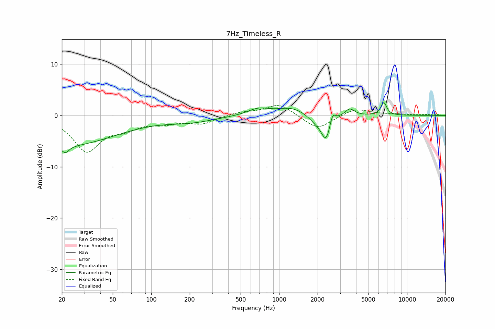

# 7Hz_Timeless_R
See [usage instructions](https://github.com/jaakkopasanen/AutoEq#usage) for more options and info.

### Parametric EQs
Apply preamp of -2.6 dB when using parametric equalizer.

|   # | Type    |   Fc (Hz) |    Q |   Gain (dB) |
|-----|---------|-----------|------|-------------|
|   1 | Peaking |        21 | 0.35 |        -5.8 |
|   2 | Peaking |        21 | 5.06 |        -1.4 |
|   3 | Peaking |       205 | 0.75 |        -1.1 |
|   4 | Peaking |       688 | 1.66 |         1.3 |
|   5 | Peaking |      1258 | 1.27 |         1.5 |
|   6 | Peaking |      1926 | 2.45 |        -1.1 |
|   7 | Peaking |      2340 | 3.63 |        -5.1 |
|   8 | Peaking |      2607 | 6    |         2.6 |
|   9 | Peaking |      3563 | 3.8  |         1.5 |
|  10 | Peaking |      6580 | 6    |         2.5 |

### Fixed Band EQs
When using fixed band (also called graphic) equalizer, apply preamp of **-2.0 dB** (if available) and set gains manually with these parameters.

|   # | Type    |   Fc (Hz) |    Q |   Gain (dB) |
|-----|---------|-----------|------|-------------|
|   1 | Peaking |        31 | 1.41 |        -6.7 |
|   2 | Peaking |        62 | 1.41 |        -2   |
|   3 | Peaking |       125 | 1.41 |        -1.2 |
|   4 | Peaking |       250 | 1.41 |        -1.5 |
|   5 | Peaking |       500 | 1.41 |         0.6 |
|   6 | Peaking |      1000 | 1.41 |         2.3 |
|   7 | Peaking |      2000 | 1.41 |        -2.8 |
|   8 | Peaking |      4000 | 1.41 |         1.4 |
|   9 | Peaking |      8000 | 1.41 |         0.2 |
|  10 | Peaking |     16000 | 1.41 |         0.2 |

### Graphs

