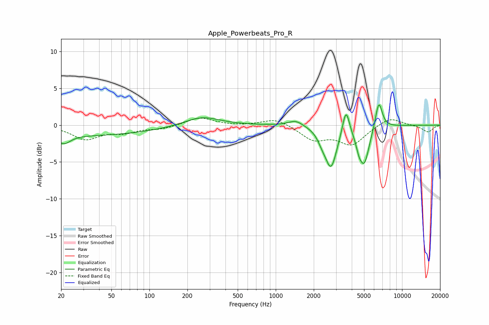

# Apple_Powerbeats_Pro_R
See [usage instructions](https://github.com/jaakkopasanen/AutoEq#usage) for more options and info.

### Parametric EQs
Apply preamp of -2.8 dB when using parametric equalizer.

|   # | Type    |   Fc (Hz) |    Q |   Gain (dB) |
|-----|---------|-----------|------|-------------|
|   1 | Peaking |        21 | 2.76 |        -1.2 |
|   2 | Peaking |        32 | 0.25 |        -1.4 |
|   3 | Peaking |       260 | 1.02 |         1.3 |
|   4 | Peaking |      1443 | 2.39 |         0.8 |
|   5 | Peaking |      2317 | 4.49 |        -0.8 |
|   6 | Peaking |      2735 | 3.01 |        -5.6 |
|   7 | Peaking |      3595 | 5.18 |         3.6 |
|   8 | Peaking |      4550 | 5.98 |        -1.2 |
|   9 | Peaking |      5022 | 3.42 |        -5   |
|  10 | Peaking |      6542 | 5    |         3.8 |

### Fixed Band EQs
When using fixed band (also called graphic) equalizer, apply preamp of **-1.0 dB** (if available) and set gains manually with these parameters.

|   # | Type    |   Fc (Hz) |    Q |   Gain (dB) |
|-----|---------|-----------|------|-------------|
|   1 | Peaking |        31 | 1.41 |        -1.8 |
|   2 | Peaking |        62 | 1.41 |        -0.9 |
|   3 | Peaking |       125 | 1.41 |        -0.5 |
|   4 | Peaking |       250 | 1.41 |         1.1 |
|   5 | Peaking |       500 | 1.41 |        -0.1 |
|   6 | Peaking |      1000 | 1.41 |         1   |
|   7 | Peaking |      2000 | 1.41 |        -1.9 |
|   8 | Peaking |      4000 | 1.41 |        -2.5 |
|   9 | Peaking |      8000 | 1.41 |         1.2 |
|  10 | Peaking |     16000 | 1.41 |        -0.9 |

### Graphs

