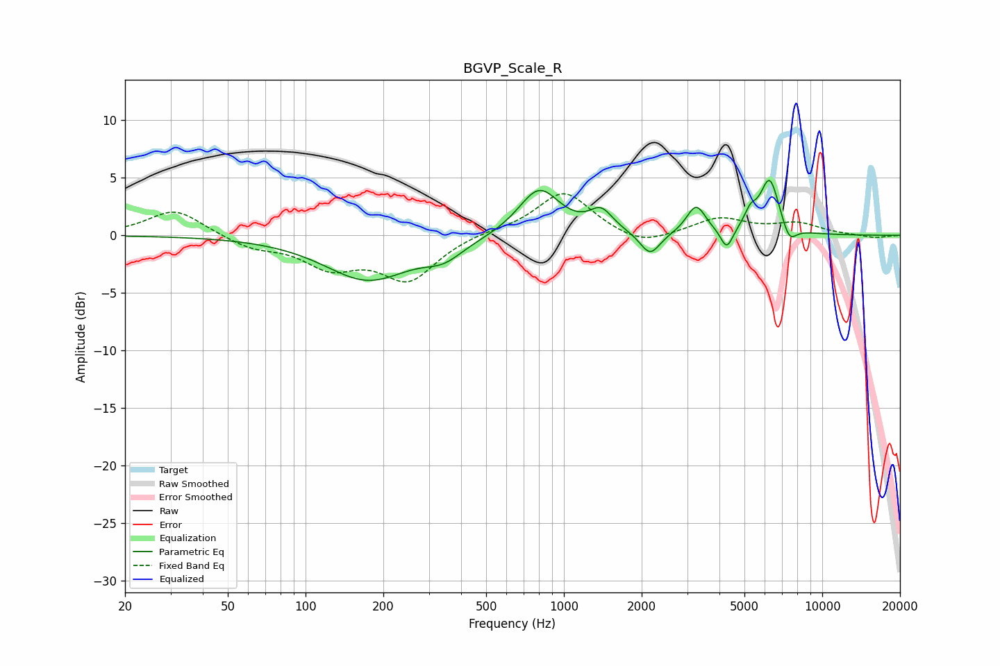

# BGVP_Scale_R
See [usage instructions](https://github.com/jaakkopasanen/AutoEq#usage) for more options and info.

### Parametric EQs
Apply preamp of -4.9 dB when using parametric equalizer.

|   # | Type    |   Fc (Hz) |    Q |   Gain (dB) |
|-----|---------|-----------|------|-------------|
|   1 | Peaking |       174 | 0.85 |        -3.8 |
|   2 | Peaking |       343 | 1.89 |        -1.3 |
|   3 | Peaking |       802 | 1.77 |         4.1 |
|   4 | Peaking |      1393 | 3.14 |         1.8 |
|   5 | Peaking |      2157 | 3.63 |        -2   |
|   6 | Peaking |      3250 | 3.87 |         2.5 |
|   7 | Peaking |      4270 | 6    |        -1.8 |
|   8 | Peaking |      5267 | 5.79 |         1.3 |
|   9 | Peaking |      6259 | 3.66 |         4.9 |
|  10 | Peaking |      7449 | 4.87 |        -1.5 |

### Fixed Band EQs
When using fixed band (also called graphic) equalizer, apply preamp of **-3.7 dB** (if available) and set gains manually with these parameters.

|   # | Type    |   Fc (Hz) |    Q |   Gain (dB) |
|-----|---------|-----------|------|-------------|
|   1 | Peaking |        31 | 1.41 |         2.3 |
|   2 | Peaking |        62 | 1.41 |        -1   |
|   3 | Peaking |       125 | 1.41 |        -2.5 |
|   4 | Peaking |       250 | 1.41 |        -3.7 |
|   5 | Peaking |       500 | 1.41 |         0.3 |
|   6 | Peaking |      1000 | 1.41 |         3.8 |
|   7 | Peaking |      2000 | 1.41 |        -1.1 |
|   8 | Peaking |      4000 | 1.41 |         1.5 |
|   9 | Peaking |      8000 | 1.41 |         1   |
|  10 | Peaking |     16000 | 1.41 |        -0.2 |

### Graphs

