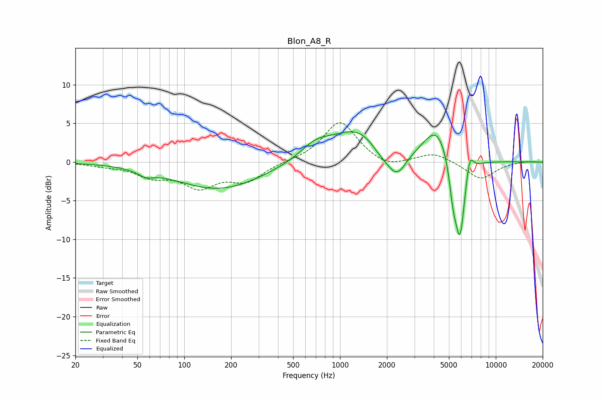

# Blon_A8_R
See [usage instructions](https://github.com/jaakkopasanen/AutoEq#usage) for more options and info.

### Parametric EQs
Apply preamp of -4.0 dB when using parametric equalizer.

|   # | Type    |   Fc (Hz) |    Q |   Gain (dB) |
|-----|---------|-----------|------|-------------|
|   1 | Peaking |        57 | 2.81 |        -0.8 |
|   2 | Peaking |       167 | 0.51 |        -3.5 |
|   3 | Peaking |       696 | 1.44 |         1.7 |
|   4 | Peaking |      1321 | 0.8  |         4.3 |
|   5 | Peaking |      1824 | 2.09 |        -1.4 |
|   6 | Peaking |      2313 | 2.25 |        -3.5 |
|   7 | Peaking |      4190 | 1.67 |         4.5 |
|   8 | Peaking |      5320 | 5.77 |        -3.8 |
|   9 | Peaking |      5890 | 4.22 |       -10.5 |
|  10 | Peaking |      6797 | 5.88 |         2.8 |

### Fixed Band EQs
When using fixed band (also called graphic) equalizer, apply preamp of **-5.2 dB** (if available) and set gains manually with these parameters.

|   # | Type    |   Fc (Hz) |    Q |   Gain (dB) |
|-----|---------|-----------|------|-------------|
|   1 | Peaking |        31 | 1.41 |        -0.4 |
|   2 | Peaking |        62 | 1.41 |        -1.7 |
|   3 | Peaking |       125 | 1.41 |        -2.9 |
|   4 | Peaking |       250 | 1.41 |        -2.3 |
|   5 | Peaking |       500 | 1.41 |         0.1 |
|   6 | Peaking |      1000 | 1.41 |         5.3 |
|   7 | Peaking |      2000 | 1.41 |        -1   |
|   8 | Peaking |      4000 | 1.41 |         1.2 |
|   9 | Peaking |      8000 | 1.41 |        -2.2 |
|  10 | Peaking |     16000 | 1.41 |         0.1 |

### Graphs

