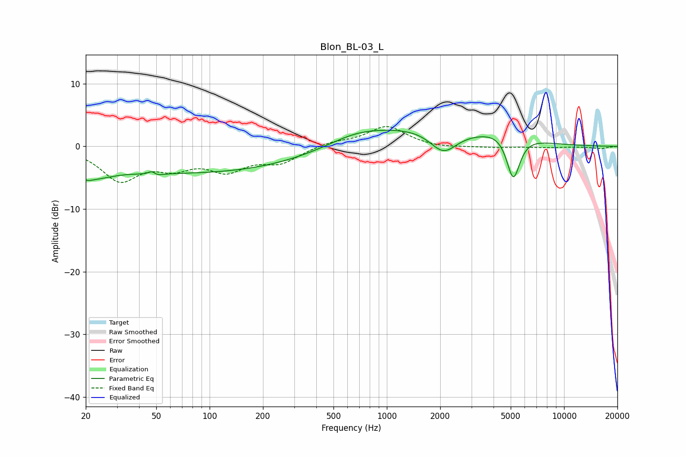

# Blon_BL-03_L
See [usage instructions](https://github.com/jaakkopasanen/AutoEq#usage) for more options and info.

### Parametric EQs
Apply preamp of -2.7 dB when using parametric equalizer.

|   # | Type    |   Fc (Hz) |    Q |   Gain (dB) |
|-----|---------|-----------|------|-------------|
|   1 | Peaking |        20 | 3.9  |        -0.8 |
|   2 | Peaking |        22 | 1.23 |        -2.1 |
|   3 | Peaking |        48 | 5.39 |         3.2 |
|   4 | Peaking |        48 | 4.73 |        -3   |
|   5 | Peaking |        81 | 0.22 |        -4.2 |
|   6 | Peaking |       671 | 0.87 |         1.6 |
|   7 | Peaking |      1612 | 0.47 |         2.9 |
|   8 | Peaking |      2085 | 1.81 |        -3.7 |
|   9 | Peaking |      4879 | 1.19 |         2.5 |
|  10 | Peaking |      5169 | 3.43 |        -8   |

### Fixed Band EQs
When using fixed band (also called graphic) equalizer, apply preamp of **-3.3 dB** (if available) and set gains manually with these parameters.

|   # | Type    |   Fc (Hz) |    Q |   Gain (dB) |
|-----|---------|-----------|------|-------------|
|   1 | Peaking |        31 | 1.41 |        -5.1 |
|   2 | Peaking |        62 | 1.41 |        -2.7 |
|   3 | Peaking |       125 | 1.41 |        -3.4 |
|   4 | Peaking |       250 | 1.41 |        -2.3 |
|   5 | Peaking |       500 | 1.41 |         0.7 |
|   6 | Peaking |      1000 | 1.41 |         3.2 |
|   7 | Peaking |      2000 | 1.41 |        -0.3 |
|   8 | Peaking |      4000 | 1.41 |        -0.2 |
|   9 | Peaking |      8000 | 1.41 |        -0.2 |
|  10 | Peaking |     16000 | 1.41 |        -0.4 |

### Graphs

