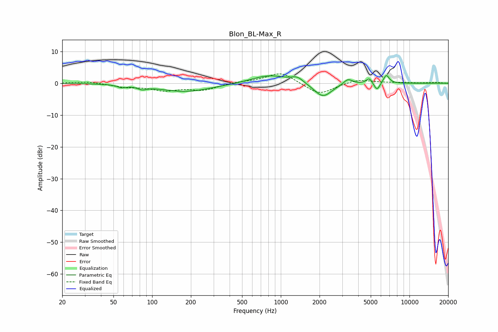

# Blon_BL-Max_R
See [usage instructions](https://github.com/jaakkopasanen/AutoEq#usage) for more options and info.

### Parametric EQs
Apply preamp of -2.5 dB when using parametric equalizer.

|   # | Type    |   Fc (Hz) |    Q |   Gain (dB) |
|-----|---------|-----------|------|-------------|
|   1 | Peaking |        58 | 4.31 |        -0.8 |
|   2 | Peaking |        84 | 4.23 |        -1   |
|   3 | Peaking |       182 | 0.69 |        -2.6 |
|   4 | Peaking |       817 | 1.01 |         2.7 |
|   5 | Peaking |      1345 | 3.03 |         1.7 |
|   6 | Peaking |      2124 | 2.04 |        -4.6 |
|   7 | Peaking |      3324 | 4.04 |         1.8 |
|   8 | Peaking |      4874 | 6    |         1.8 |
|   9 | Peaking |      5588 | 5.99 |        -2.5 |
|  10 | Peaking |      6600 | 6    |         2.8 |

### Fixed Band EQs
When using fixed band (also called graphic) equalizer, apply preamp of **-3.1 dB** (if available) and set gains manually with these parameters.

|   # | Type    |   Fc (Hz) |    Q |   Gain (dB) |
|-----|---------|-----------|------|-------------|
|   1 | Peaking |        31 | 1.41 |         0.6 |
|   2 | Peaking |        62 | 1.41 |        -1.1 |
|   3 | Peaking |       125 | 1.41 |        -2   |
|   4 | Peaking |       250 | 1.41 |        -2   |
|   5 | Peaking |       500 | 1.41 |         0.5 |
|   6 | Peaking |      1000 | 1.41 |         3.6 |
|   7 | Peaking |      2000 | 1.41 |        -3.7 |
|   8 | Peaking |      4000 | 1.41 |         1.3 |
|   9 | Peaking |      8000 | 1.41 |         0.2 |
|  10 | Peaking |     16000 | 1.41 |         0.3 |

### Graphs

