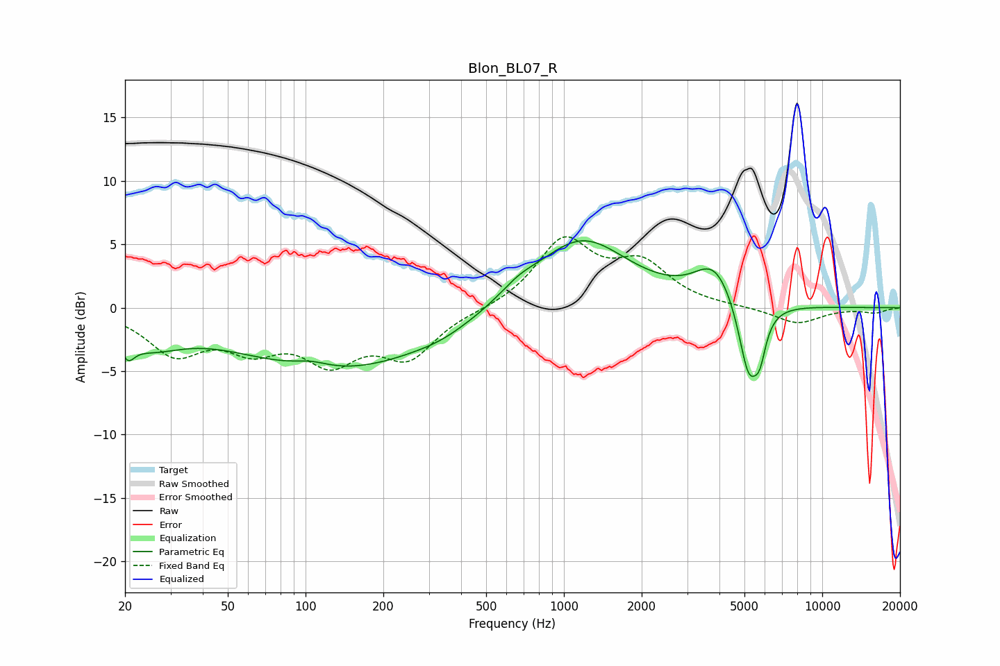

# Blon_BL07_R
See [usage instructions](https://github.com/jaakkopasanen/AutoEq#usage) for more options and info.

### Parametric EQs
Apply preamp of -5.4 dB when using parametric equalizer.

|   # | Type    |   Fc (Hz) |    Q |   Gain (dB) |
|-----|---------|-----------|------|-------------|
|   1 | Peaking |        21 | 5.6  |        -1.4 |
|   2 | Peaking |        24 | 1.09 |        -2.2 |
|   3 | Peaking |       105 | 2.05 |         0.5 |
|   4 | Peaking |       134 | 0.36 |        -4.9 |
|   5 | Peaking |       334 | 1.53 |        -0.3 |
|   6 | Peaking |       663 | 1.89 |         0.8 |
|   7 | Peaking |      1166 | 0.78 |         5.6 |
|   8 | Peaking |      3830 | 1.8  |         3   |
|   9 | Peaking |      5193 | 3.49 |        -6   |
|  10 | Peaking |      5735 | 6    |        -2.3 |

### Fixed Band EQs
When using fixed band (also called graphic) equalizer, apply preamp of **-5.7 dB** (if available) and set gains manually with these parameters.

|   # | Type    |   Fc (Hz) |    Q |   Gain (dB) |
|-----|---------|-----------|------|-------------|
|   1 | Peaking |        31 | 1.41 |        -3.4 |
|   2 | Peaking |        62 | 1.41 |        -2.6 |
|   3 | Peaking |       125 | 1.41 |        -3.7 |
|   4 | Peaking |       250 | 1.41 |        -3.6 |
|   5 | Peaking |       500 | 1.41 |        -0.2 |
|   6 | Peaking |      1000 | 1.41 |         5.2 |
|   7 | Peaking |      2000 | 1.41 |         3.1 |
|   8 | Peaking |      4000 | 1.41 |         0   |
|   9 | Peaking |      8000 | 1.41 |        -1.3 |
|  10 | Peaking |     16000 | 1.41 |        -0.4 |

### Graphs

