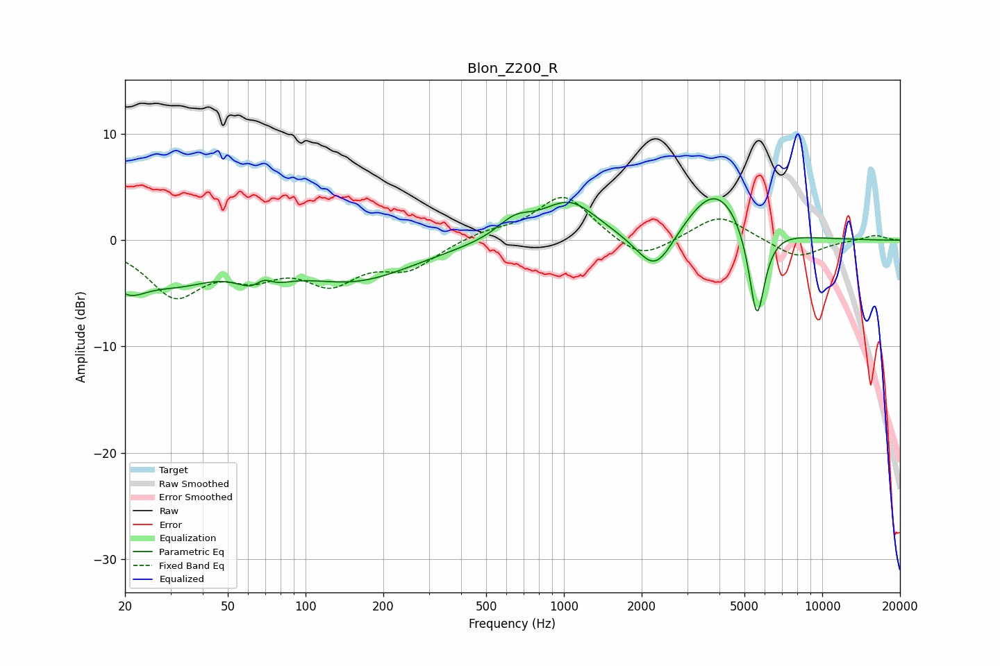

# Blon_Z200_R
See [usage instructions](https://github.com/jaakkopasanen/AutoEq#usage) for more options and info.

### Parametric EQs
Apply preamp of -4.0 dB when using parametric equalizer.

|   # | Type    |   Fc (Hz) |    Q |   Gain (dB) |
|-----|---------|-----------|------|-------------|
|   1 | Peaking |        20 | 1.82 |        -3.1 |
|   2 | Peaking |        32 | 0.9  |        -3   |
|   3 | Peaking |        67 | 2.13 |        -3.8 |
|   4 | Peaking |        69 | 3.39 |         2.6 |
|   5 | Peaking |       155 | 0.61 |        -3.6 |
|   6 | Peaking |       645 | 2.06 |         1.7 |
|   7 | Peaking |      1049 | 1.31 |         3.6 |
|   8 | Peaking |      2261 | 1.88 |        -4.2 |
|   9 | Peaking |      3861 | 1.19 |         5.3 |
|  10 | Peaking |      5584 | 4.36 |        -9.2 |

### Fixed Band EQs
When using fixed band (also called graphic) equalizer, apply preamp of **-4.1 dB** (if available) and set gains manually with these parameters.

|   # | Type    |   Fc (Hz) |    Q |   Gain (dB) |
|-----|---------|-----------|------|-------------|
|   1 | Peaking |        31 | 1.41 |        -4.9 |
|   2 | Peaking |        62 | 1.41 |        -2.6 |
|   3 | Peaking |       125 | 1.41 |        -3.5 |
|   4 | Peaking |       250 | 1.41 |        -2.4 |
|   5 | Peaking |       500 | 1.41 |         0.7 |
|   6 | Peaking |      1000 | 1.41 |         4.3 |
|   7 | Peaking |      2000 | 1.41 |        -2.1 |
|   8 | Peaking |      4000 | 1.41 |         2.5 |
|   9 | Peaking |      8000 | 1.41 |        -1.7 |
|  10 | Peaking |     16000 | 1.41 |         0.5 |

### Graphs

