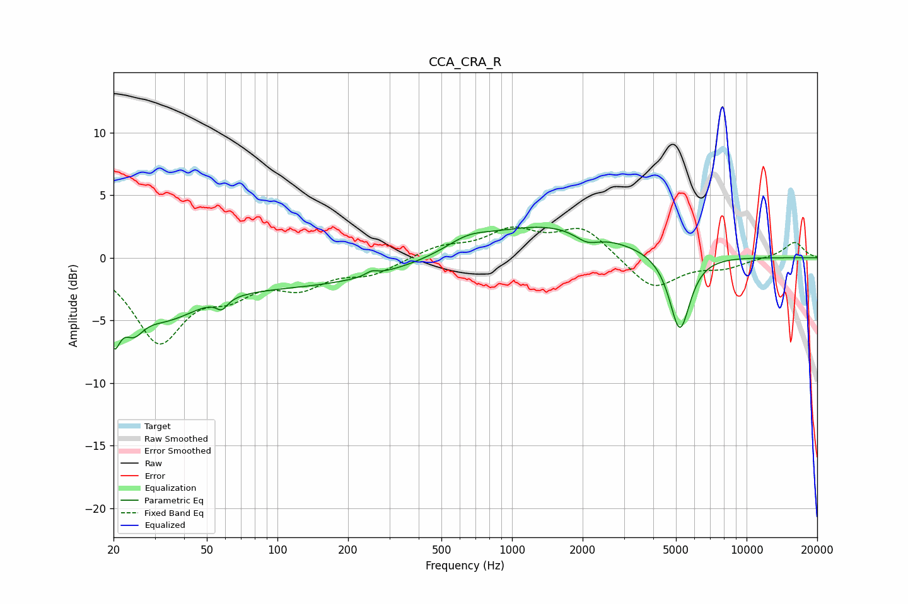

# CCA_CRA_R
See [usage instructions](https://github.com/jaakkopasanen/AutoEq#usage) for more options and info.

### Parametric EQs
Apply preamp of -2.5 dB when using parametric equalizer.

|   # | Type    |   Fc (Hz) |    Q |   Gain (dB) |
|-----|---------|-----------|------|-------------|
|   1 | Peaking |        20 | 5.06 |        -4   |
|   2 | Peaking |        24 | 3.3  |        -2.1 |
|   3 | Peaking |        32 | 0.89 |        -3.6 |
|   4 | Peaking |        58 | 5.89 |        -0.8 |
|   5 | Peaking |       128 | 0.31 |        -2.1 |
|   6 | Peaking |       252 | 5.99 |         0.3 |
|   7 | Peaking |       645 | 1.56 |         0.9 |
|   8 | Peaking |      1393 | 0.48 |         2.7 |
|   9 | Peaking |      2087 | 2.75 |        -0.8 |
|  10 | Peaking |      5191 | 3.15 |        -6.2 |

### Fixed Band EQs
When using fixed band (also called graphic) equalizer, apply preamp of **-2.6 dB** (if available) and set gains manually with these parameters.

|   # | Type    |   Fc (Hz) |    Q |   Gain (dB) |
|-----|---------|-----------|------|-------------|
|   1 | Peaking |        31 | 1.41 |        -6.4 |
|   2 | Peaking |        62 | 1.41 |        -2.2 |
|   3 | Peaking |       125 | 1.41 |        -2   |
|   4 | Peaking |       250 | 1.41 |        -1.2 |
|   5 | Peaking |       500 | 1.41 |         0.9 |
|   6 | Peaking |      1000 | 1.41 |         2   |
|   7 | Peaking |      2000 | 1.41 |         2.4 |
|   8 | Peaking |      4000 | 1.41 |        -2.6 |
|   9 | Peaking |      8000 | 1.41 |        -0.7 |
|  10 | Peaking |     16000 | 1.41 |         1.3 |

### Graphs

