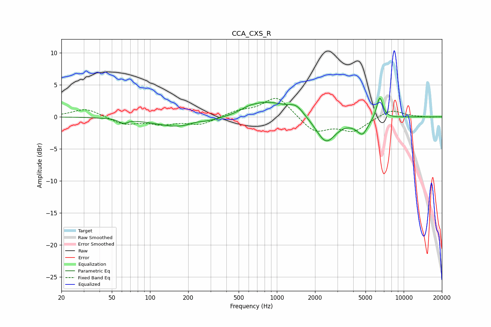

# CCA_CXS_R
See [usage instructions](https://github.com/jaakkopasanen/AutoEq#usage) for more options and info.

### Parametric EQs
Apply preamp of -3.0 dB when using parametric equalizer.

|   # | Type    |   Fc (Hz) |    Q |   Gain (dB) |
|-----|---------|-----------|------|-------------|
|   1 | Peaking |        62 | 4.48 |        -0.6 |
|   2 | Peaking |       177 | 0.69 |        -1.7 |
|   3 | Peaking |       230 | 2.45 |         0.4 |
|   4 | Peaking |       605 | 2.27 |         0.5 |
|   5 | Peaking |       853 | 0.93 |         2.3 |
|   6 | Peaking |      1420 | 2.41 |         1.4 |
|   7 | Peaking |      2441 | 1.81 |        -4.1 |
|   8 | Peaking |      4183 | 2.24 |        -0.4 |
|   9 | Peaking |      4746 | 3.31 |        -2.2 |
|  10 | Peaking |      6473 | 5.56 |         3.5 |

### Fixed Band EQs
When using fixed band (also called graphic) equalizer, apply preamp of **-3.0 dB** (if available) and set gains manually with these parameters.

|   # | Type    |   Fc (Hz) |    Q |   Gain (dB) |
|-----|---------|-----------|------|-------------|
|   1 | Peaking |        31 | 1.41 |         1.3 |
|   2 | Peaking |        62 | 1.41 |        -1.2 |
|   3 | Peaking |       125 | 1.41 |        -1   |
|   4 | Peaking |       250 | 1.41 |        -1.2 |
|   5 | Peaking |       500 | 1.41 |         0.8 |
|   6 | Peaking |      1000 | 1.41 |         3.2 |
|   7 | Peaking |      2000 | 1.41 |        -2.4 |
|   8 | Peaking |      4000 | 1.41 |        -2.1 |
|   9 | Peaking |      8000 | 1.41 |         1.2 |
|  10 | Peaking |     16000 | 1.41 |        -0.1 |

### Graphs

