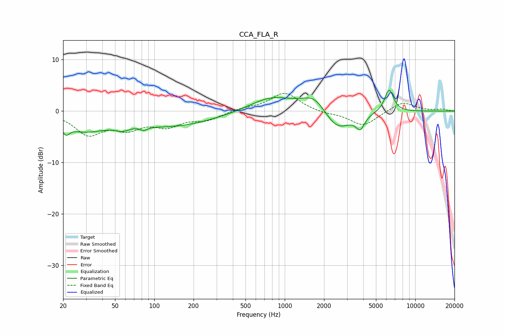

# CCA_FLA_R
See [usage instructions](https://github.com/jaakkopasanen/AutoEq#usage) for more options and info.

### Parametric EQs
Apply preamp of -4.1 dB when using parametric equalizer.

|   # | Type    |   Fc (Hz) |    Q |   Gain (dB) |
|-----|---------|-----------|------|-------------|
|   1 | Peaking |        21 | 5.26 |        -1.8 |
|   2 | Peaking |        29 | 0.81 |        -3.4 |
|   3 | Peaking |        57 | 2.73 |        -1   |
|   4 | Peaking |        83 | 5.22 |        -0.7 |
|   5 | Peaking |       140 | 0.44 |        -2.8 |
|   6 | Peaking |       793 | 0.86 |         2.8 |
|   7 | Peaking |      1701 | 1.44 |         3.4 |
|   8 | Peaking |      2498 | 1.3  |        -4.4 |
|   9 | Peaking |      3793 | 4.36 |        -2.5 |
|  10 | Peaking |      6303 | 4.05 |         4.4 |

### Fixed Band EQs
When using fixed band (also called graphic) equalizer, apply preamp of **-3.5 dB** (if available) and set gains manually with these parameters.

|   # | Type    |   Fc (Hz) |    Q |   Gain (dB) |
|-----|---------|-----------|------|-------------|
|   1 | Peaking |        31 | 1.41 |        -4.3 |
|   2 | Peaking |        62 | 1.41 |        -2.8 |
|   3 | Peaking |       125 | 1.41 |        -2.5 |
|   4 | Peaking |       250 | 1.41 |        -1.6 |
|   5 | Peaking |       500 | 1.41 |         0.5 |
|   6 | Peaking |      1000 | 1.41 |         3.6 |
|   7 | Peaking |      2000 | 1.41 |        -0.4 |
|   8 | Peaking |      4000 | 1.41 |        -2.9 |
|   9 | Peaking |      8000 | 1.41 |         1.9 |
|  10 | Peaking |     16000 | 1.41 |         0.3 |

### Graphs

