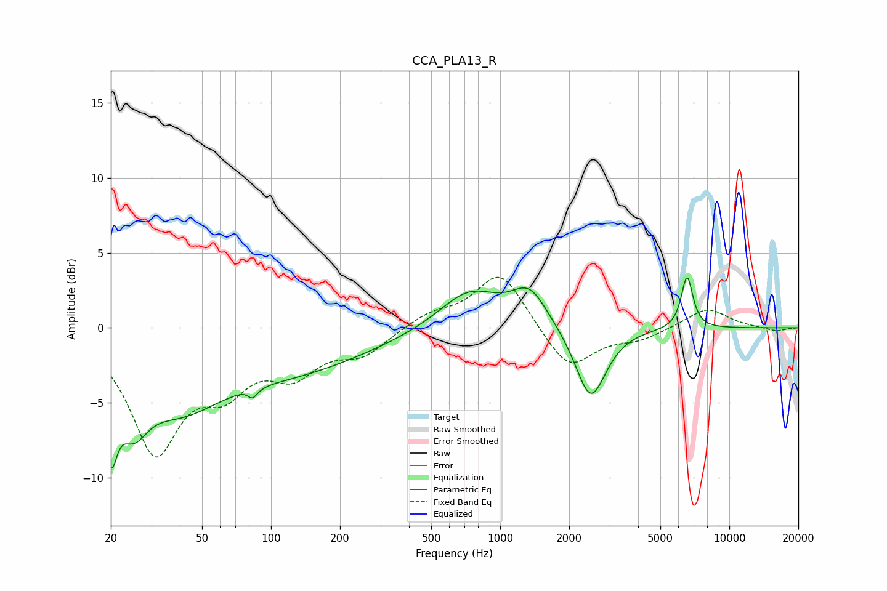

# CCA_PLA13_R
See [usage instructions](https://github.com/jaakkopasanen/AutoEq#usage) for more options and info.

### Parametric EQs
Apply preamp of -3.4 dB when using parametric equalizer.

|   # | Type    |   Fc (Hz) |    Q |   Gain (dB) |
|-----|---------|-----------|------|-------------|
|   1 | Peaking |        20 | 5.42 |        -5.1 |
|   2 | Peaking |        25 | 2.08 |        -3.8 |
|   3 | Peaking |        39 | 0.77 |        -4   |
|   4 | Peaking |        82 | 5.17 |         2.7 |
|   5 | Peaking |        82 | 5.5  |        -3.3 |
|   6 | Peaking |       119 | 0.4  |        -2.7 |
|   7 | Peaking |       731 | 1.08 |         2.5 |
|   8 | Peaking |      1343 | 1.81 |         2.4 |
|   9 | Peaking |      2484 | 2.12 |        -4.9 |
|  10 | Peaking |      6541 | 5.51 |         3.5 |

### Fixed Band EQs
When using fixed band (also called graphic) equalizer, apply preamp of **-3.5 dB** (if available) and set gains manually with these parameters.

|   # | Type    |   Fc (Hz) |    Q |   Gain (dB) |
|-----|---------|-----------|------|-------------|
|   1 | Peaking |        31 | 1.41 |        -7.9 |
|   2 | Peaking |        62 | 1.41 |        -3.2 |
|   3 | Peaking |       125 | 1.41 |        -2.6 |
|   4 | Peaking |       250 | 1.41 |        -1.6 |
|   5 | Peaking |       500 | 1.41 |         0.9 |
|   6 | Peaking |      1000 | 1.41 |         3.8 |
|   7 | Peaking |      2000 | 1.41 |        -2.9 |
|   8 | Peaking |      4000 | 1.41 |        -0.7 |
|   9 | Peaking |      8000 | 1.41 |         1.3 |
|  10 | Peaking |     16000 | 1.41 |        -0.2 |

### Graphs

