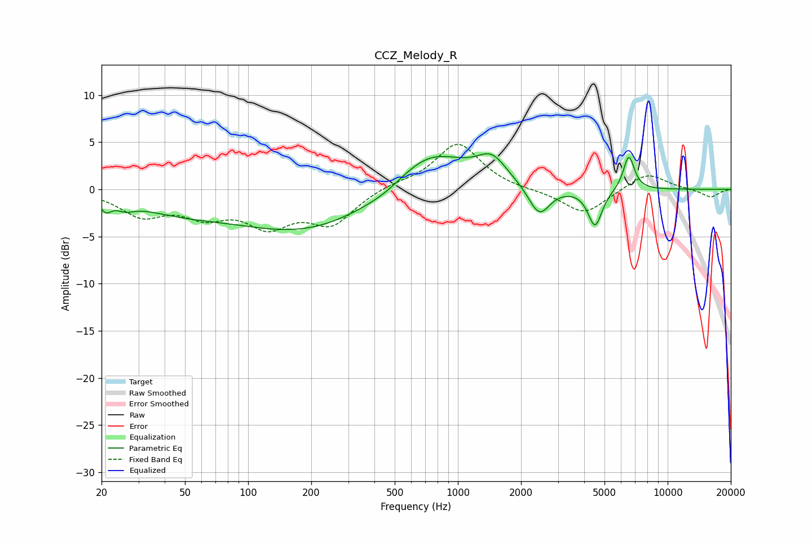

# CCZ_Melody_R
See [usage instructions](https://github.com/jaakkopasanen/AutoEq#usage) for more options and info.

### Parametric EQs
Apply preamp of -3.9 dB when using parametric equalizer.

|   # | Type    |   Fc (Hz) |    Q |   Gain (dB) |
|-----|---------|-----------|------|-------------|
|   1 | Peaking |        21 | 5.58 |        -1.2 |
|   2 | Peaking |        26 | 3.33 |        -0.7 |
|   3 | Peaking |        46 | 0.61 |        -1.7 |
|   4 | Peaking |       190 | 0.42 |        -4.3 |
|   5 | Peaking |       464 | 1.26 |        -0.8 |
|   6 | Peaking |       714 | 0.77 |         4.8 |
|   7 | Peaking |      1453 | 2    |         2.5 |
|   8 | Peaking |      2441 | 2.76 |        -3.2 |
|   9 | Peaking |      4508 | 4.17 |        -4   |
|  10 | Peaking |      6530 | 5.23 |         3.7 |

### Fixed Band EQs
When using fixed band (also called graphic) equalizer, apply preamp of **-4.9 dB** (if available) and set gains manually with these parameters.

|   # | Type    |   Fc (Hz) |    Q |   Gain (dB) |
|-----|---------|-----------|------|-------------|
|   1 | Peaking |        31 | 1.41 |        -2.6 |
|   2 | Peaking |        62 | 1.41 |        -2.3 |
|   3 | Peaking |       125 | 1.41 |        -3.4 |
|   4 | Peaking |       250 | 1.41 |        -3.4 |
|   5 | Peaking |       500 | 1.41 |         0.5 |
|   6 | Peaking |      1000 | 1.41 |         4.9 |
|   7 | Peaking |      2000 | 1.41 |        -0.1 |
|   8 | Peaking |      4000 | 1.41 |        -2.7 |
|   9 | Peaking |      8000 | 1.41 |         1.8 |
|  10 | Peaking |     16000 | 1.41 |        -0.9 |

### Graphs

