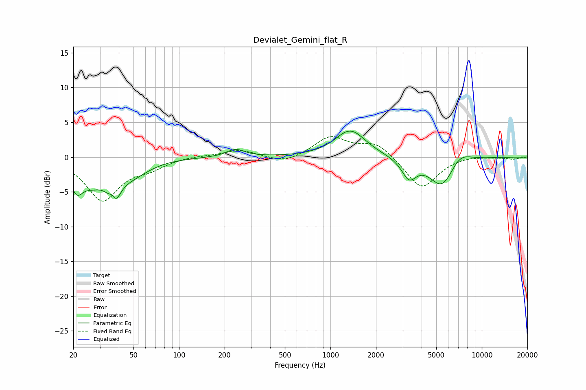

# Devialet_Gemini_flat_R
See [usage instructions](https://github.com/jaakkopasanen/AutoEq#usage) for more options and info.

### Parametric EQs
Apply preamp of -3.8 dB when using parametric equalizer.

|   # | Type    |   Fc (Hz) |    Q |   Gain (dB) |
|-----|---------|-----------|------|-------------|
|   1 | Peaking |        21 | 3.45 |        -3.4 |
|   2 | Peaking |        27 | 1.77 |        -2.6 |
|   3 | Peaking |        36 | 5.99 |         3   |
|   4 | Peaking |        37 | 3.83 |        -5.8 |
|   5 | Peaking |        49 | 1.23 |        -2.1 |
|   6 | Peaking |       236 | 2.33 |         1.1 |
|   7 | Peaking |      1355 | 1.41 |         3.9 |
|   8 | Peaking |      3304 | 2.93 |        -2.8 |
|   9 | Peaking |      5476 | 1.64 |        -4.5 |
|  10 | Peaking |      7080 | 1.81 |         1.9 |

### Fixed Band EQs
When using fixed band (also called graphic) equalizer, apply preamp of **-3.0 dB** (if available) and set gains manually with these parameters.

|   # | Type    |   Fc (Hz) |    Q |   Gain (dB) |
|-----|---------|-----------|------|-------------|
|   1 | Peaking |        31 | 1.41 |        -6.1 |
|   2 | Peaking |        62 | 1.41 |        -1.3 |
|   3 | Peaking |       125 | 1.41 |         0.2 |
|   4 | Peaking |       250 | 1.41 |         1   |
|   5 | Peaking |       500 | 1.41 |        -1   |
|   6 | Peaking |      1000 | 1.41 |         2.8 |
|   7 | Peaking |      2000 | 1.41 |         2.1 |
|   8 | Peaking |      4000 | 1.41 |        -4.6 |
|   9 | Peaking |      8000 | 1.41 |         0.3 |
|  10 | Peaking |     16000 | 1.41 |        -0.3 |

### Graphs

