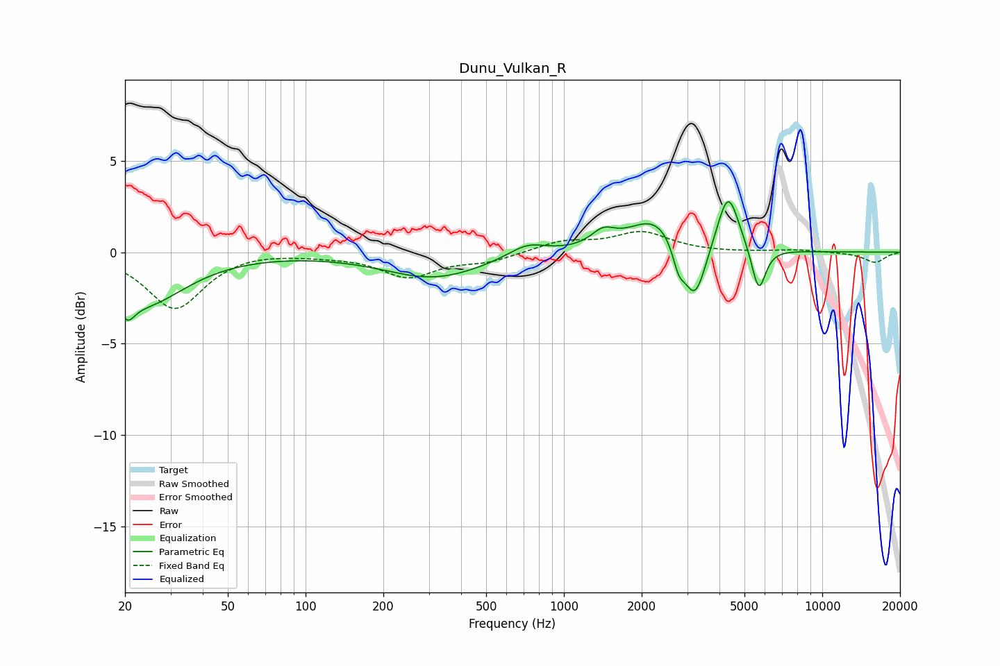

# Dunu_Vulkan_R
See [usage instructions](https://github.com/jaakkopasanen/AutoEq#usage) for more options and info.

### Parametric EQs
Apply preamp of -2.9 dB when using parametric equalizer.

|   # | Type    |   Fc (Hz) |    Q |   Gain (dB) |
|-----|---------|-----------|------|-------------|
|   1 | Peaking |        20 | 5.02 |        -1.1 |
|   2 | Peaking |        23 | 0.88 |        -2.8 |
|   3 | Peaking |       314 | 0.73 |        -1.4 |
|   4 | Peaking |       721 | 1.9  |         0.7 |
|   5 | Peaking |      1418 | 3.12 |         0.8 |
|   6 | Peaking |      2278 | 1.35 |         1.9 |
|   7 | Peaking |      2780 | 5.98 |        -1.3 |
|   8 | Peaking |      3211 | 3.21 |        -3.3 |
|   9 | Peaking |      4321 | 3.35 |         3.3 |
|  10 | Peaking |      5676 | 5.16 |        -2.5 |

### Fixed Band EQs
When using fixed band (also called graphic) equalizer, apply preamp of **-1.2 dB** (if available) and set gains manually with these parameters.

|   # | Type    |   Fc (Hz) |    Q |   Gain (dB) |
|-----|---------|-----------|------|-------------|
|   1 | Peaking |        31 | 1.41 |        -3.1 |
|   2 | Peaking |        62 | 1.41 |         0.1 |
|   3 | Peaking |       125 | 1.41 |        -0.1 |
|   4 | Peaking |       250 | 1.41 |        -1.3 |
|   5 | Peaking |       500 | 1.41 |        -0.5 |
|   6 | Peaking |      1000 | 1.41 |         0.6 |
|   7 | Peaking |      2000 | 1.41 |         1.1 |
|   8 | Peaking |      4000 | 1.41 |        -0   |
|   9 | Peaking |      8000 | 1.41 |         0.1 |
|  10 | Peaking |     16000 | 1.41 |        -0.6 |

### Graphs

