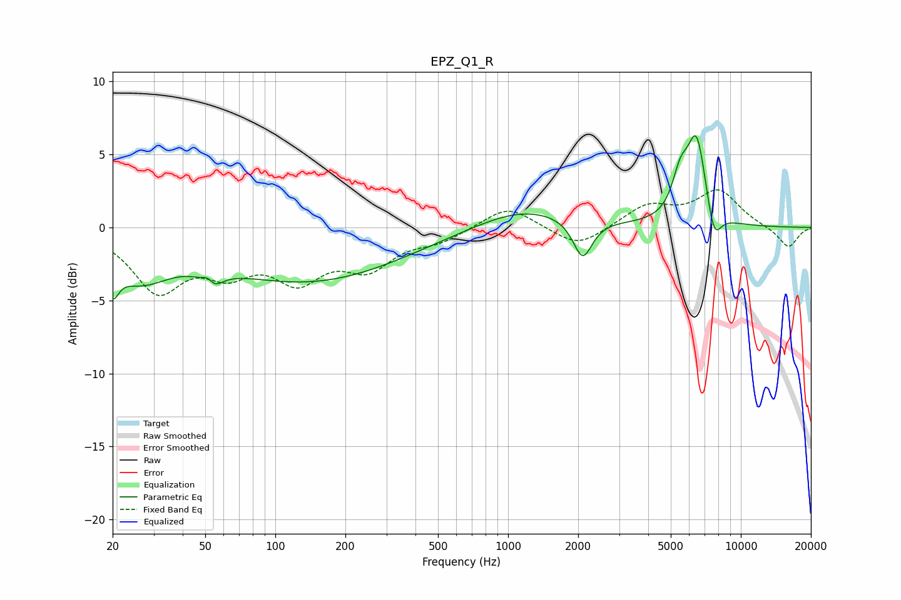

# EPZ_Q1_R
See [usage instructions](https://github.com/jaakkopasanen/AutoEq#usage) for more options and info.

### Parametric EQs
Apply preamp of -6.4 dB when using parametric equalizer.

|   # | Type    |   Fc (Hz) |    Q |   Gain (dB) |
|-----|---------|-----------|------|-------------|
|   1 | Peaking |        20 | 5.6  |        -2   |
|   2 | Peaking |        26 | 1.05 |        -2.9 |
|   3 | Peaking |        52 | 4.67 |         3   |
|   4 | Peaking |        52 | 3.96 |        -3.5 |
|   5 | Peaking |       139 | 0.35 |        -3.6 |
|   6 | Peaking |      1162 | 0.69 |         1.4 |
|   7 | Peaking |      2093 | 3.47 |        -2.7 |
|   8 | Peaking |      5493 | 3.97 |         2.4 |
|   9 | Peaking |      6455 | 3.27 |         5.9 |
|  10 | Peaking |      7666 | 4.37 |        -2.3 |

### Fixed Band EQs
When using fixed band (also called graphic) equalizer, apply preamp of **-2.7 dB** (if available) and set gains manually with these parameters.

|   # | Type    |   Fc (Hz) |    Q |   Gain (dB) |
|-----|---------|-----------|------|-------------|
|   1 | Peaking |        31 | 1.41 |        -4.1 |
|   2 | Peaking |        62 | 1.41 |        -2.4 |
|   3 | Peaking |       125 | 1.41 |        -3.1 |
|   4 | Peaking |       250 | 1.41 |        -2.4 |
|   5 | Peaking |       500 | 1.41 |        -0.8 |
|   6 | Peaking |      1000 | 1.41 |         1.6 |
|   7 | Peaking |      2000 | 1.41 |        -1.4 |
|   8 | Peaking |      4000 | 1.41 |         1.5 |
|   9 | Peaking |      8000 | 1.41 |         2.5 |
|  10 | Peaking |     16000 | 1.41 |        -1.4 |

### Graphs

