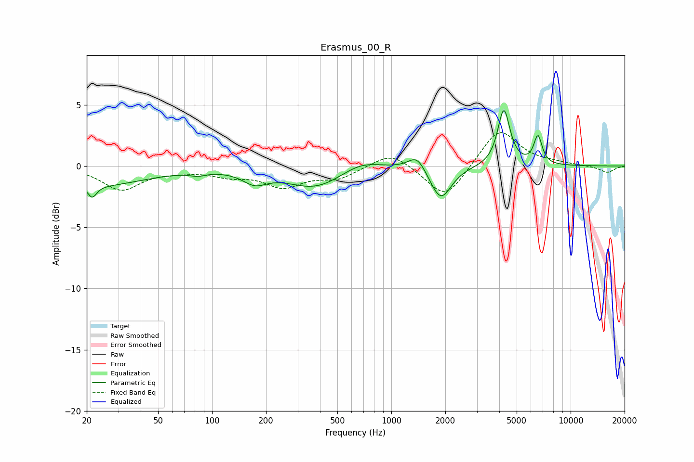

# Erasmus_00_R
See [usage instructions](https://github.com/jaakkopasanen/AutoEq#usage) for more options and info.

### Parametric EQs
Apply preamp of -4.6 dB when using parametric equalizer.

|   # | Type    |   Fc (Hz) |    Q |   Gain (dB) |
|-----|---------|-----------|------|-------------|
|   1 | Peaking |        21 | 5.72 |        -1   |
|   2 | Peaking |        24 | 0.54 |        -1.5 |
|   3 | Peaking |        83 | 3.19 |        -0.3 |
|   4 | Peaking |       173 | 2.09 |        -1   |
|   5 | Peaking |       377 | 0.88 |        -1.8 |
|   6 | Peaking |       674 | 1.27 |         0.8 |
|   7 | Peaking |      1392 | 2.91 |         1.3 |
|   8 | Peaking |      1885 | 2.42 |        -2.8 |
|   9 | Peaking |      4240 | 4.23 |         4.6 |
|  10 | Peaking |      6570 | 6    |         2.3 |

### Fixed Band EQs
When using fixed band (also called graphic) equalizer, apply preamp of **-2.8 dB** (if available) and set gains manually with these parameters.

|   # | Type    |   Fc (Hz) |    Q |   Gain (dB) |
|-----|---------|-----------|------|-------------|
|   1 | Peaking |        31 | 1.41 |        -1.9 |
|   2 | Peaking |        62 | 1.41 |        -0.3 |
|   3 | Peaking |       125 | 1.41 |        -0.6 |
|   4 | Peaking |       250 | 1.41 |        -1.6 |
|   5 | Peaking |       500 | 1.41 |        -0.9 |
|   6 | Peaking |      1000 | 1.41 |         1.3 |
|   7 | Peaking |      2000 | 1.41 |        -2.8 |
|   8 | Peaking |      4000 | 1.41 |         3.1 |
|   9 | Peaking |      8000 | 1.41 |         0.2 |
|  10 | Peaking |     16000 | 1.41 |        -0.5 |

### Graphs

