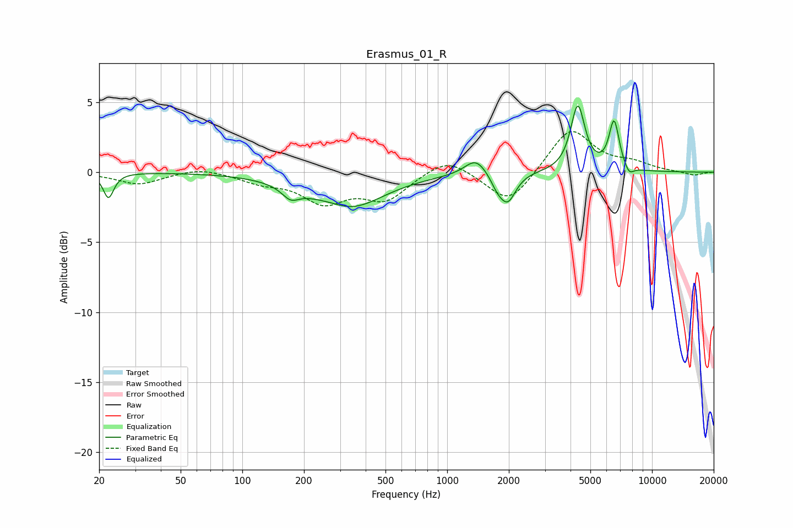

# Erasmus_01_R
See [usage instructions](https://github.com/jaakkopasanen/AutoEq#usage) for more options and info.

### Parametric EQs
Apply preamp of -4.8 dB when using parametric equalizer.

|   # | Type    |   Fc (Hz) |    Q |   Gain (dB) |
|-----|---------|-----------|------|-------------|
|   1 | Peaking |        22 | 5.64 |        -1.8 |
|   2 | Peaking |       172 | 3.39 |        -0.8 |
|   3 | Peaking |       275 | 1.6  |         0.5 |
|   4 | Peaking |       317 | 0.82 |        -2.8 |
|   5 | Peaking |      1382 | 2.63 |         1.2 |
|   6 | Peaking |      1758 | 4.32 |        -0.8 |
|   7 | Peaking |      1977 | 3.59 |        -2   |
|   8 | Peaking |      4342 | 4.14 |         4.7 |
|   9 | Peaking |      6528 | 5.53 |         3.5 |
|  10 | Peaking |      7729 | 5.95 |        -0.6 |

### Fixed Band EQs
When using fixed band (also called graphic) equalizer, apply preamp of **-3.0 dB** (if available) and set gains manually with these parameters.

|   # | Type    |   Fc (Hz) |    Q |   Gain (dB) |
|-----|---------|-----------|------|-------------|
|   1 | Peaking |        31 | 1.41 |        -0.9 |
|   2 | Peaking |        62 | 1.41 |         0.4 |
|   3 | Peaking |       125 | 1.41 |        -0.6 |
|   4 | Peaking |       250 | 1.41 |        -2   |
|   5 | Peaking |       500 | 1.41 |        -1.9 |
|   6 | Peaking |      1000 | 1.41 |         1.2 |
|   7 | Peaking |      2000 | 1.41 |        -2.4 |
|   8 | Peaking |      4000 | 1.41 |         3.2 |
|   9 | Peaking |      8000 | 1.41 |         0.5 |
|  10 | Peaking |     16000 | 1.41 |        -0.3 |

### Graphs

