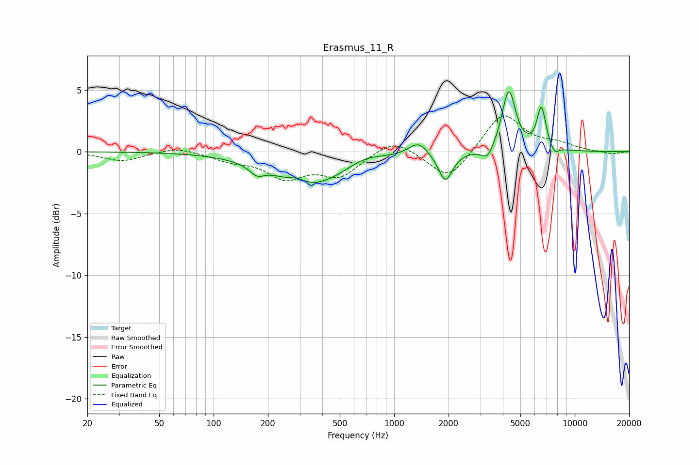

# Erasmus_11_R
See [usage instructions](https://github.com/jaakkopasanen/AutoEq#usage) for more options and info.

### Parametric EQs
Apply preamp of -4.9 dB when using parametric equalizer.

|   # | Type    |   Fc (Hz) |    Q |   Gain (dB) |
|-----|---------|-----------|------|-------------|
|   1 | Peaking |       174 | 3.53 |        -0.7 |
|   2 | Peaking |       290 | 3.35 |         0.4 |
|   3 | Peaking |       347 | 0.7  |        -2.7 |
|   4 | Peaking |       682 | 1.45 |         0.6 |
|   5 | Peaking |      1362 | 2.71 |         1.1 |
|   6 | Peaking |      1922 | 3.63 |        -2.4 |
|   7 | Peaking |      3292 | 4.24 |        -1.1 |
|   8 | Peaking |      4313 | 3.76 |         5   |
|   9 | Peaking |      6536 | 5.65 |         3.4 |
|  10 | Peaking |      7733 | 5.94 |        -0.6 |

### Fixed Band EQs
When using fixed band (also called graphic) equalizer, apply preamp of **-3.0 dB** (if available) and set gains manually with these parameters.

|   # | Type    |   Fc (Hz) |    Q |   Gain (dB) |
|-----|---------|-----------|------|-------------|
|   1 | Peaking |        31 | 1.41 |        -0.8 |
|   2 | Peaking |        62 | 1.41 |         0.4 |
|   3 | Peaking |       125 | 1.41 |        -0.6 |
|   4 | Peaking |       250 | 1.41 |        -1.9 |
|   5 | Peaking |       500 | 1.41 |        -1.8 |
|   6 | Peaking |      1000 | 1.41 |         1.2 |
|   7 | Peaking |      2000 | 1.41 |        -2.4 |
|   8 | Peaking |      4000 | 1.41 |         3.2 |
|   9 | Peaking |      8000 | 1.41 |         0.5 |
|  10 | Peaking |     16000 | 1.41 |        -0.2 |

### Graphs

