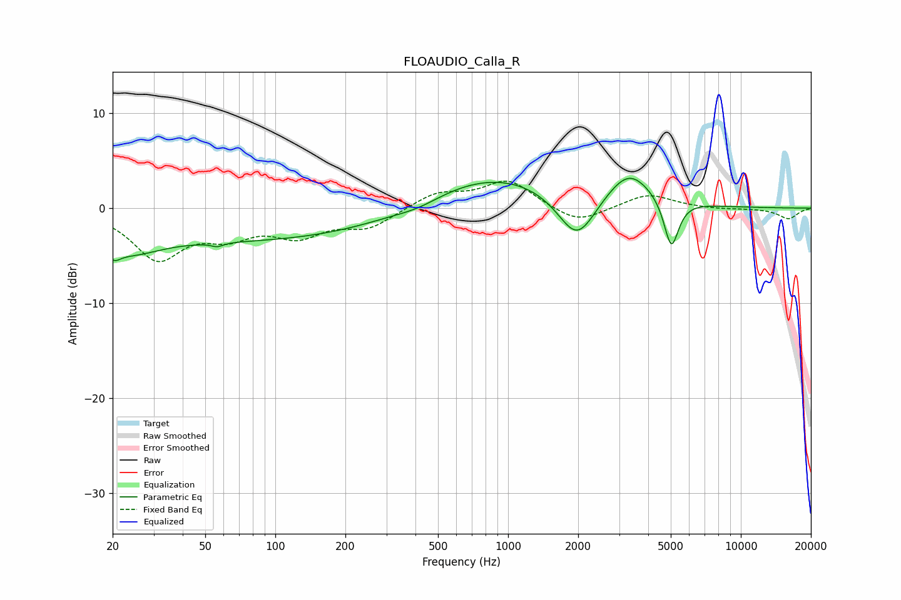

# FLOAUDIO_Calla_R
See [usage instructions](https://github.com/jaakkopasanen/AutoEq#usage) for more options and info.

### Parametric EQs
Apply preamp of -3.2 dB when using parametric equalizer.

|   # | Type    |   Fc (Hz) |    Q |   Gain (dB) |
|-----|---------|-----------|------|-------------|
|   1 | Peaking |        20 | 4.8  |        -1.3 |
|   2 | Peaking |        24 | 1.16 |        -2.1 |
|   3 | Peaking |        56 | 5.64 |        -0.4 |
|   4 | Peaking |        77 | 0.18 |        -3.4 |
|   5 | Peaking |       412 | 1.48 |        -0.6 |
|   6 | Peaking |       836 | 0.46 |         3.9 |
|   7 | Peaking |      1980 | 1.68 |        -5.4 |
|   8 | Peaking |      3287 | 1.18 |         2.7 |
|   9 | Peaking |      3322 | 2    |         1.1 |
|  10 | Peaking |      5028 | 4.41 |        -5.3 |

### Fixed Band EQs
When using fixed band (also called graphic) equalizer, apply preamp of **-2.9 dB** (if available) and set gains manually with these parameters.

|   # | Type    |   Fc (Hz) |    Q |   Gain (dB) |
|-----|---------|-----------|------|-------------|
|   1 | Peaking |        31 | 1.41 |        -5.1 |
|   2 | Peaking |        62 | 1.41 |        -2.3 |
|   3 | Peaking |       125 | 1.41 |        -2.5 |
|   4 | Peaking |       250 | 1.41 |        -1.9 |
|   5 | Peaking |       500 | 1.41 |         1.6 |
|   6 | Peaking |      1000 | 1.41 |         2.9 |
|   7 | Peaking |      2000 | 1.41 |        -1.7 |
|   8 | Peaking |      4000 | 1.41 |         1.5 |
|   9 | Peaking |      8000 | 1.41 |        -0.1 |
|  10 | Peaking |     16000 | 1.41 |        -1.1 |

### Graphs

