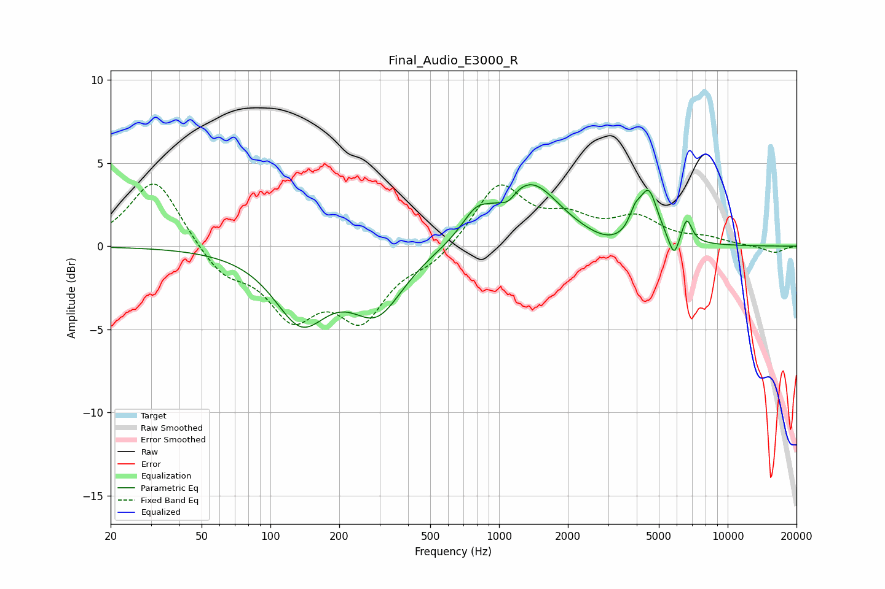

# Final_Audio_E3000_R
See [usage instructions](https://github.com/jaakkopasanen/AutoEq#usage) for more options and info.

### Parametric EQs
Apply preamp of -3.8 dB when using parametric equalizer.

|   # | Type    |   Fc (Hz) |    Q |   Gain (dB) |
|-----|---------|-----------|------|-------------|
|   1 | Peaking |       136 | 1.22 |        -4.2 |
|   2 | Peaking |       293 | 1.23 |        -3.6 |
|   3 | Peaking |       793 | 2.25 |         1.4 |
|   4 | Peaking |      1097 | 4.61 |        -0.5 |
|   5 | Peaking |      1365 | 1.08 |         3.8 |
|   6 | Peaking |      3051 | 1.41 |        -0.5 |
|   7 | Peaking |      3935 | 5.38 |         1.1 |
|   8 | Peaking |      4515 | 3.53 |         3   |
|   9 | Peaking |      5822 | 5.99 |        -1.4 |
|  10 | Peaking |      6620 | 6    |         1.5 |

### Fixed Band EQs
When using fixed band (also called graphic) equalizer, apply preamp of **-3.8 dB** (if available) and set gains manually with these parameters.

|   # | Type    |   Fc (Hz) |    Q |   Gain (dB) |
|-----|---------|-----------|------|-------------|
|   1 | Peaking |        31 | 1.41 |         4.2 |
|   2 | Peaking |        62 | 1.41 |        -1.6 |
|   3 | Peaking |       125 | 1.41 |        -3.8 |
|   4 | Peaking |       250 | 1.41 |        -4   |
|   5 | Peaking |       500 | 1.41 |        -0.9 |
|   6 | Peaking |      1000 | 1.41 |         3.7 |
|   7 | Peaking |      2000 | 1.41 |         1.4 |
|   8 | Peaking |      4000 | 1.41 |         1.5 |
|   9 | Peaking |      8000 | 1.41 |         0.4 |
|  10 | Peaking |     16000 | 1.41 |        -0.4 |

### Graphs

