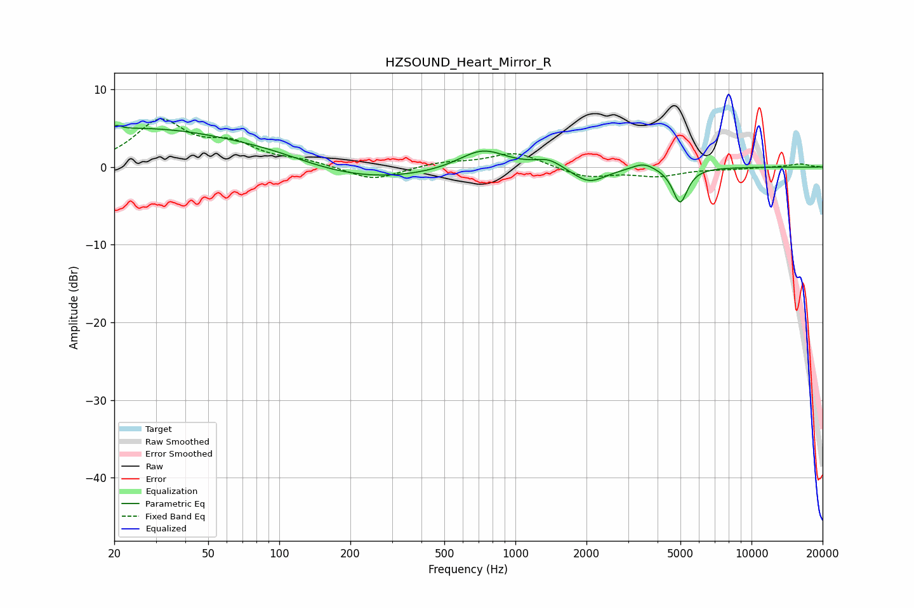

# HZSOUND_Heart_Mirror_R
See [usage instructions](https://github.com/jaakkopasanen/AutoEq#usage) for more options and info.

### Parametric EQs
Apply preamp of -5.5 dB when using parametric equalizer.

|   # | Type    |   Fc (Hz) |    Q |   Gain (dB) |
|-----|---------|-----------|------|-------------|
|   1 | Peaking |        20 | 5.57 |        -2.7 |
|   2 | Peaking |        20 | 5.96 |         3.1 |
|   3 | Peaking |        26 | 0.29 |         5   |
|   4 | Peaking |        95 | 0.94 |         0.5 |
|   5 | Peaking |       233 | 0.48 |        -1.9 |
|   6 | Peaking |       724 | 1.42 |         2.6 |
|   7 | Peaking |      1384 | 2.47 |         1.1 |
|   8 | Peaking |      2051 | 2.01 |        -2.1 |
|   9 | Peaking |      3491 | 3.11 |         0.9 |
|  10 | Peaking |      4982 | 4.52 |        -4.6 |

### Fixed Band EQs
When using fixed band (also called graphic) equalizer, apply preamp of **-6.3 dB** (if available) and set gains manually with these parameters.

|   # | Type    |   Fc (Hz) |    Q |   Gain (dB) |
|-----|---------|-----------|------|-------------|
|   1 | Peaking |        31 | 1.41 |         5.7 |
|   2 | Peaking |        62 | 1.41 |         2.5 |
|   3 | Peaking |       125 | 1.41 |         0.7 |
|   4 | Peaking |       250 | 1.41 |        -1.8 |
|   5 | Peaking |       500 | 1.41 |         0.6 |
|   6 | Peaking |      1000 | 1.41 |         1.9 |
|   7 | Peaking |      2000 | 1.41 |        -1.3 |
|   8 | Peaking |      4000 | 1.41 |        -1.1 |
|   9 | Peaking |      8000 | 1.41 |        -0.2 |
|  10 | Peaking |     16000 | 1.41 |         0.4 |

### Graphs

