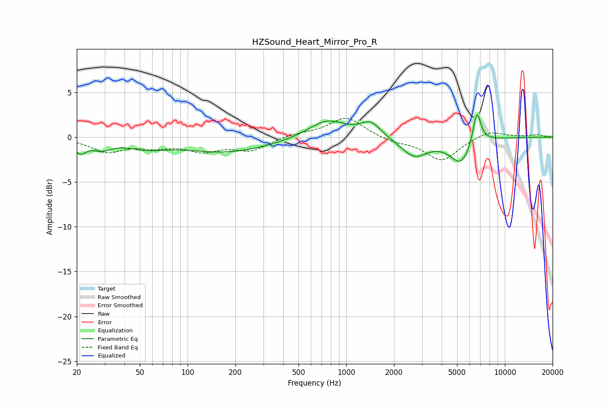

# HZSound_Heart_Mirror_Pro_R
See [usage instructions](https://github.com/jaakkopasanen/AutoEq#usage) for more options and info.

### Parametric EQs
Apply preamp of -2.6 dB when using parametric equalizer.

|   # | Type    |   Fc (Hz) |    Q |   Gain (dB) |
|-----|---------|-----------|------|-------------|
|   1 | Peaking |        21 | 3.84 |        -1.4 |
|   2 | Peaking |        29 | 2.21 |        -1   |
|   3 | Peaking |        55 | 1.16 |        -0.9 |
|   4 | Peaking |       177 | 0.49 |        -1.6 |
|   5 | Peaking |       761 | 1.18 |         2   |
|   6 | Peaking |      1426 | 2.34 |         1.6 |
|   7 | Peaking |      2687 | 1.68 |        -2.1 |
|   8 | Peaking |      5354 | 1.92 |        -3.3 |
|   9 | Peaking |      6421 | 2.08 |         1   |
|  10 | Peaking |      6669 | 5.77 |         3.3 |

### Fixed Band EQs
When using fixed band (also called graphic) equalizer, apply preamp of **-2.2 dB** (if available) and set gains manually with these parameters.

|   # | Type    |   Fc (Hz) |    Q |   Gain (dB) |
|-----|---------|-----------|------|-------------|
|   1 | Peaking |        31 | 1.41 |        -1.5 |
|   2 | Peaking |        62 | 1.41 |        -0.9 |
|   3 | Peaking |       125 | 1.41 |        -1.3 |
|   4 | Peaking |       250 | 1.41 |        -1.4 |
|   5 | Peaking |       500 | 1.41 |         0.4 |
|   6 | Peaking |      1000 | 1.41 |         2.3 |
|   7 | Peaking |      2000 | 1.41 |        -0.5 |
|   8 | Peaking |      4000 | 1.41 |        -2.6 |
|   9 | Peaking |      8000 | 1.41 |         0.8 |
|  10 | Peaking |     16000 | 1.41 |         0.3 |

### Graphs

