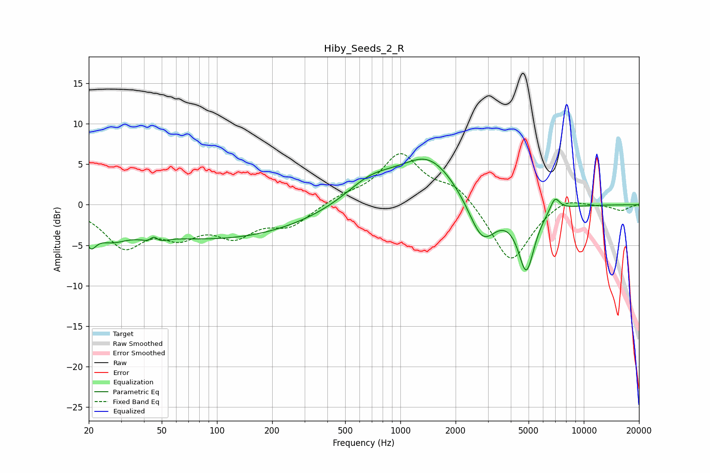

# Hiby_Seeds_2_R
See [usage instructions](https://github.com/jaakkopasanen/AutoEq#usage) for more options and info.

### Parametric EQs
Apply preamp of -5.7 dB when using parametric equalizer.

|   # | Type    |   Fc (Hz) |    Q |   Gain (dB) |
|-----|---------|-----------|------|-------------|
|   1 | Peaking |        20 | 4.71 |        -2.5 |
|   2 | Peaking |        26 | 1.48 |        -2.2 |
|   3 | Peaking |        45 | 4.07 |        -3.7 |
|   4 | Peaking |        45 | 5.18 |         3.6 |
|   5 | Peaking |       101 | 0.28 |        -4.2 |
|   6 | Peaking |       686 | 1.01 |         2.7 |
|   7 | Peaking |      1436 | 0.87 |         5.8 |
|   8 | Peaking |      2798 | 1.82 |        -5.6 |
|   9 | Peaking |      4860 | 3.06 |        -7.9 |
|  10 | Peaking |      6958 | 5.08 |         1.8 |

### Fixed Band EQs
When using fixed band (also called graphic) equalizer, apply preamp of **-6.4 dB** (if available) and set gains manually with these parameters.

|   # | Type    |   Fc (Hz) |    Q |   Gain (dB) |
|-----|---------|-----------|------|-------------|
|   1 | Peaking |        31 | 1.41 |        -4.8 |
|   2 | Peaking |        62 | 1.41 |        -3.1 |
|   3 | Peaking |       125 | 1.41 |        -3.3 |
|   4 | Peaking |       250 | 1.41 |        -2.4 |
|   5 | Peaking |       500 | 1.41 |         0.9 |
|   6 | Peaking |      1000 | 1.41 |         6.1 |
|   7 | Peaking |      2000 | 1.41 |         2.3 |
|   8 | Peaking |      4000 | 1.41 |        -7.3 |
|   9 | Peaking |      8000 | 1.41 |         1.2 |
|  10 | Peaking |     16000 | 1.41 |        -0.7 |

### Graphs

