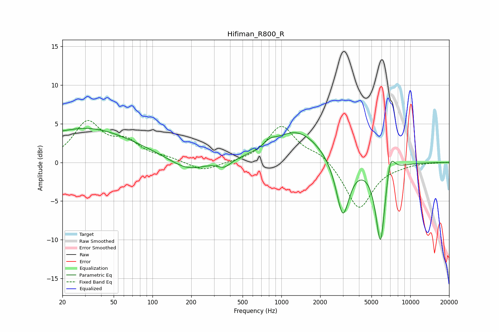

# Hifiman_R800_R
See [usage instructions](https://github.com/jaakkopasanen/AutoEq#usage) for more options and info.

### Parametric EQs
Apply preamp of -4.5 dB when using parametric equalizer.

|   # | Type    |   Fc (Hz) |    Q |   Gain (dB) |
|-----|---------|-----------|------|-------------|
|   1 | Peaking |        20 | 5.84 |         0.1 |
|   2 | Peaking |        27 | 0.44 |         3.9 |
|   3 | Peaking |        64 | 0.51 |         1   |
|   4 | Peaking |       187 | 1.05 |        -1.5 |
|   5 | Peaking |       361 | 2.86 |        -0.9 |
|   6 | Peaking |       815 | 3.32 |         0.7 |
|   7 | Peaking |      1324 | 0.75 |         4.1 |
|   8 | Peaking |      2994 | 2.74 |        -7.6 |
|   9 | Peaking |      5874 | 3.65 |       -10.8 |
|  10 | Peaking |      6984 | 3.95 |         3.3 |

### Fixed Band EQs
When using fixed band (also called graphic) equalizer, apply preamp of **-5.5 dB** (if available) and set gains manually with these parameters.

|   # | Type    |   Fc (Hz) |    Q |   Gain (dB) |
|-----|---------|-----------|------|-------------|
|   1 | Peaking |        31 | 1.41 |         5   |
|   2 | Peaking |        62 | 1.41 |         2.3 |
|   3 | Peaking |       125 | 1.41 |         0.5 |
|   4 | Peaking |       250 | 1.41 |        -1.2 |
|   5 | Peaking |       500 | 1.41 |        -0   |
|   6 | Peaking |      1000 | 1.41 |         4.7 |
|   7 | Peaking |      2000 | 1.41 |         1.2 |
|   8 | Peaking |      4000 | 1.41 |        -6.1 |
|   9 | Peaking |      8000 | 1.41 |        -0.2 |
|  10 | Peaking |     16000 | 1.41 |        -0   |

### Graphs

