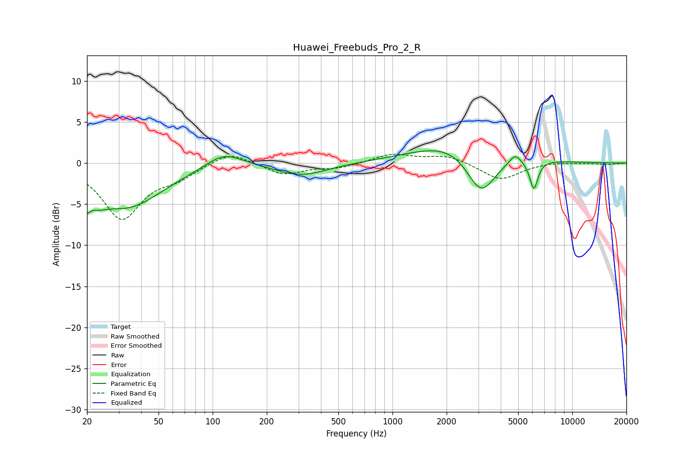

# Huawei_Freebuds_Pro_2_R
See [usage instructions](https://github.com/jaakkopasanen/AutoEq#usage) for more options and info.

### Parametric EQs
Apply preamp of -1.6 dB when using parametric equalizer.

|   # | Type    |   Fc (Hz) |    Q |   Gain (dB) |
|-----|---------|-----------|------|-------------|
|   1 | Peaking |        20 | 5.61 |        -5.1 |
|   2 | Peaking |        20 | 5.89 |         3   |
|   3 | Peaking |        23 | 2.77 |        -1.1 |
|   4 | Peaking |        33 | 0.71 |        -5.3 |
|   5 | Peaking |       116 | 1.37 |         1.9 |
|   6 | Peaking |       313 | 0.99 |        -1.5 |
|   7 | Peaking |      2446 | 0.6  |         3.2 |
|   8 | Peaking |      3109 | 1.64 |        -5.9 |
|   9 | Peaking |      4810 | 4.5  |         1.1 |
|  10 | Peaking |      6111 | 6    |        -3.6 |

### Fixed Band EQs
When using fixed band (also called graphic) equalizer, apply preamp of **-1.2 dB** (if available) and set gains manually with these parameters.

|   # | Type    |   Fc (Hz) |    Q |   Gain (dB) |
|-----|---------|-----------|------|-------------|
|   1 | Peaking |        31 | 1.41 |        -6.6 |
|   2 | Peaking |        62 | 1.41 |        -1.4 |
|   3 | Peaking |       125 | 1.41 |         1.5 |
|   4 | Peaking |       250 | 1.41 |        -1.4 |
|   5 | Peaking |       500 | 1.41 |        -0.6 |
|   6 | Peaking |      1000 | 1.41 |         1.1 |
|   7 | Peaking |      2000 | 1.41 |         0.9 |
|   8 | Peaking |      4000 | 1.41 |        -2.1 |
|   9 | Peaking |      8000 | 1.41 |         0.2 |
|  10 | Peaking |     16000 | 1.41 |        -0.2 |

### Graphs

