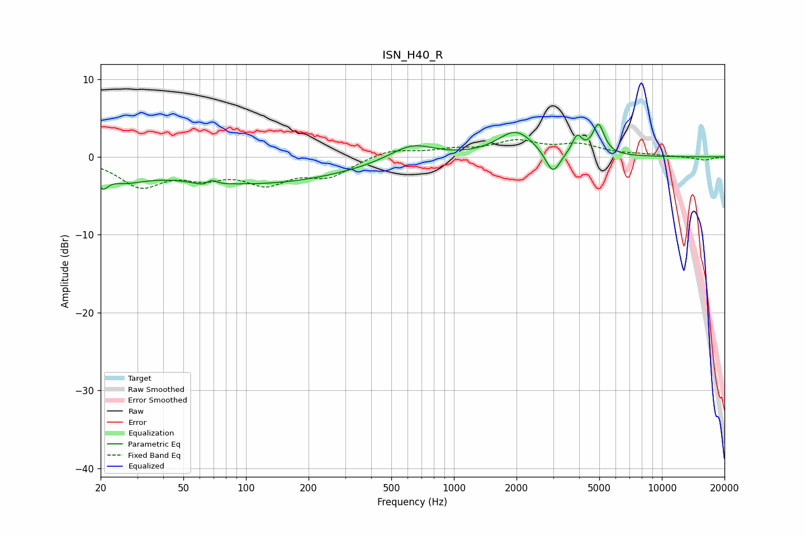

# ISN_H40_R
See [usage instructions](https://github.com/jaakkopasanen/AutoEq#usage) for more options and info.

### Parametric EQs
Apply preamp of -4.3 dB when using parametric equalizer.

|   # | Type    |   Fc (Hz) |    Q |   Gain (dB) |
|-----|---------|-----------|------|-------------|
|   1 | Peaking |        20 | 5.83 |        -1.7 |
|   2 | Peaking |        25 | 1.27 |        -1.9 |
|   3 | Peaking |        67 | 3.67 |        -2.8 |
|   4 | Peaking |        67 | 4.36 |         2.9 |
|   5 | Peaking |       112 | 0.31 |        -3.4 |
|   6 | Peaking |       627 | 1.3  |         2.1 |
|   7 | Peaking |      1986 | 1.61 |         3.3 |
|   8 | Peaking |      2988 | 4.01 |        -3.1 |
|   9 | Peaking |      3911 | 5.95 |         2.3 |
|  10 | Peaking |      4954 | 5.03 |         3.9 |

### Fixed Band EQs
When using fixed band (also called graphic) equalizer, apply preamp of **-2.3 dB** (if available) and set gains manually with these parameters.

|   # | Type    |   Fc (Hz) |    Q |   Gain (dB) |
|-----|---------|-----------|------|-------------|
|   1 | Peaking |        31 | 1.41 |        -3.5 |
|   2 | Peaking |        62 | 1.41 |        -2   |
|   3 | Peaking |       125 | 1.41 |        -3   |
|   4 | Peaking |       250 | 1.41 |        -2.3 |
|   5 | Peaking |       500 | 1.41 |         1   |
|   6 | Peaking |      1000 | 1.41 |         0.8 |
|   7 | Peaking |      2000 | 1.41 |         1.8 |
|   8 | Peaking |      4000 | 1.41 |         1.4 |
|   9 | Peaking |      8000 | 1.41 |         0.2 |
|  10 | Peaking |     16000 | 1.41 |        -0.4 |

### Graphs

