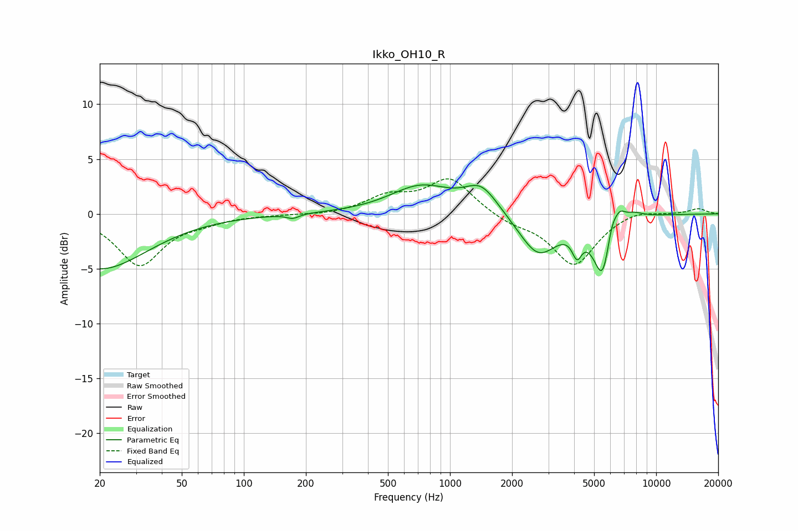

# Ikko_OH10_R
See [usage instructions](https://github.com/jaakkopasanen/AutoEq#usage) for more options and info.

### Parametric EQs
Apply preamp of -2.7 dB when using parametric equalizer.

|   # | Type    |   Fc (Hz) |    Q |   Gain (dB) |
|-----|---------|-----------|------|-------------|
|   1 | Peaking |        20 | 0.61 |        -5   |
|   2 | Peaking |       173 | 4.78 |        -0.4 |
|   3 | Peaking |       722 | 0.95 |         2.5 |
|   4 | Peaking |      1419 | 1.74 |         2.4 |
|   5 | Peaking |      2678 | 1.51 |        -3.8 |
|   6 | Peaking |      4132 | 6    |        -2   |
|   7 | Peaking |      5569 | 2.99 |        -6.8 |
|   8 | Peaking |      6057 | 3.99 |         3.4 |
|   9 | Peaking |      6710 | 6    |         0.8 |
|  10 | Peaking |      7594 | 2.46 |         0.8 |

### Fixed Band EQs
When using fixed band (also called graphic) equalizer, apply preamp of **-3.3 dB** (if available) and set gains manually with these parameters.

|   # | Type    |   Fc (Hz) |    Q |   Gain (dB) |
|-----|---------|-----------|------|-------------|
|   1 | Peaking |        31 | 1.41 |        -4.6 |
|   2 | Peaking |        62 | 1.41 |        -0.5 |
|   3 | Peaking |       125 | 1.41 |        -0   |
|   4 | Peaking |       250 | 1.41 |        -0.1 |
|   5 | Peaking |       500 | 1.41 |         1.5 |
|   6 | Peaking |      1000 | 1.41 |         3.2 |
|   7 | Peaking |      2000 | 1.41 |        -0.8 |
|   8 | Peaking |      4000 | 1.41 |        -4.7 |
|   9 | Peaking |      8000 | 1.41 |         0.5 |
|  10 | Peaking |     16000 | 1.41 |         0.5 |

### Graphs

