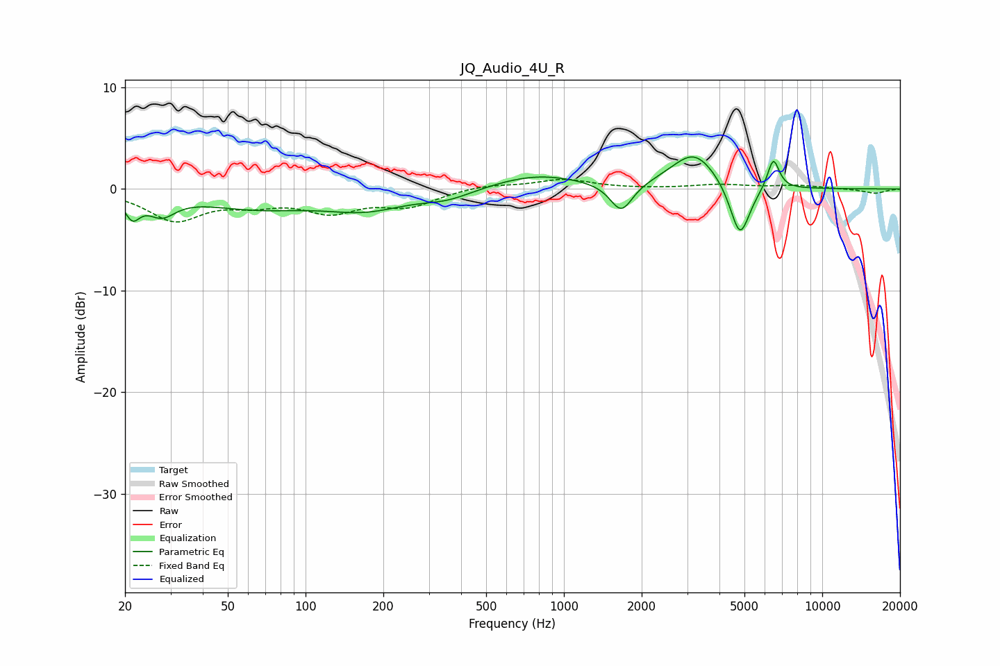

# JQ_Audio_4U_R
See [usage instructions](https://github.com/jaakkopasanen/AutoEq#usage) for more options and info.

### Parametric EQs
Apply preamp of -3.3 dB when using parametric equalizer.

|   # | Type    |   Fc (Hz) |    Q |   Gain (dB) |
|-----|---------|-----------|------|-------------|
|   1 | Peaking |        21 | 4.91 |        -2   |
|   2 | Peaking |        28 | 2.65 |        -1.9 |
|   3 | Peaking |        64 | 0.65 |        -1.7 |
|   4 | Peaking |       171 | 0.89 |        -1.7 |
|   5 | Peaking |       355 | 1.41 |        -0.9 |
|   6 | Peaking |       785 | 0.81 |         1.4 |
|   7 | Peaking |      1669 | 3.25 |        -2.9 |
|   8 | Peaking |      3197 | 1.58 |         3.6 |
|   9 | Peaking |      4803 | 3.6  |        -5.4 |
|  10 | Peaking |      6467 | 6    |         3.1 |

### Fixed Band EQs
When using fixed band (also called graphic) equalizer, apply preamp of **-1.0 dB** (if available) and set gains manually with these parameters.

|   # | Type    |   Fc (Hz) |    Q |   Gain (dB) |
|-----|---------|-----------|------|-------------|
|   1 | Peaking |        31 | 1.41 |        -3   |
|   2 | Peaking |        62 | 1.41 |        -1.1 |
|   3 | Peaking |       125 | 1.41 |        -2   |
|   4 | Peaking |       250 | 1.41 |        -1.6 |
|   5 | Peaking |       500 | 1.41 |         0.4 |
|   6 | Peaking |      1000 | 1.41 |         0.9 |
|   7 | Peaking |      2000 | 1.41 |        -0   |
|   8 | Peaking |      4000 | 1.41 |         0.4 |
|   9 | Peaking |      8000 | 1.41 |         0.3 |
|  10 | Peaking |     16000 | 1.41 |        -0.4 |

### Graphs

