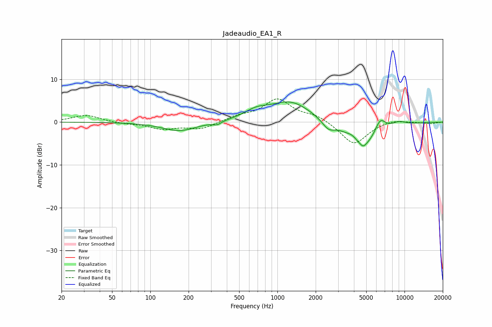

# Jadeaudio_EA1_R
See [usage instructions](https://github.com/jaakkopasanen/AutoEq#usage) for more options and info.

### Parametric EQs
Apply preamp of -4.8 dB when using parametric equalizer.

|   # | Type    |   Fc (Hz) |    Q |   Gain (dB) |
|-----|---------|-----------|------|-------------|
|   1 | Peaking |       170 | 1.05 |        -2.1 |
|   2 | Peaking |       335 | 4.32 |        -0.7 |
|   3 | Peaking |       678 | 1.51 |         1.7 |
|   4 | Peaking |      1271 | 0.85 |         4.8 |
|   5 | Peaking |      2520 | 2.88 |        -2   |
|   6 | Peaking |      3883 | 3.59 |         0.9 |
|   7 | Peaking |      4721 | 6    |        -0.9 |
|   8 | Peaking |      4811 | 1.13 |        -6.1 |
|   9 | Peaking |      6422 | 3.09 |         3.7 |
|  10 | Peaking |      8984 | 2.3  |         1   |

### Fixed Band EQs
When using fixed band (also called graphic) equalizer, apply preamp of **-5.5 dB** (if available) and set gains manually with these parameters.

|   # | Type    |   Fc (Hz) |    Q |   Gain (dB) |
|-----|---------|-----------|------|-------------|
|   1 | Peaking |        31 | 1.41 |         1.7 |
|   2 | Peaking |        62 | 1.41 |        -0.3 |
|   3 | Peaking |       125 | 1.41 |        -1.5 |
|   4 | Peaking |       250 | 1.41 |        -1.6 |
|   5 | Peaking |       500 | 1.41 |         1.2 |
|   6 | Peaking |      1000 | 1.41 |         5.2 |
|   7 | Peaking |      2000 | 1.41 |         1.5 |
|   8 | Peaking |      4000 | 1.41 |        -5.4 |
|   9 | Peaking |      8000 | 1.41 |         0.7 |
|  10 | Peaking |     16000 | 1.41 |        -0.4 |

### Graphs

