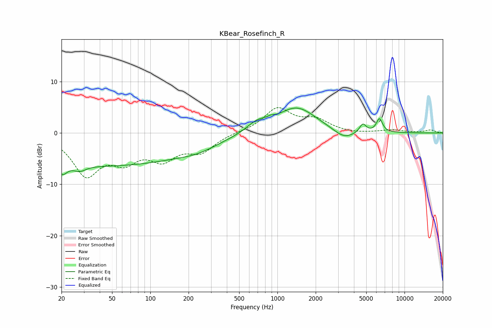

# KBear_Rosefinch_R
See [usage instructions](https://github.com/jaakkopasanen/AutoEq#usage) for more options and info.

### Parametric EQs
Apply preamp of -5.0 dB when using parametric equalizer.

|   # | Type    |   Fc (Hz) |    Q |   Gain (dB) |
|-----|---------|-----------|------|-------------|
|   1 | Peaking |        20 | 3.93 |        -2.1 |
|   2 | Peaking |        28 | 2.95 |        -1.1 |
|   3 | Peaking |        44 | 0.18 |        -6.3 |
|   4 | Peaking |       239 | 1.01 |        -0.9 |
|   5 | Peaking |       689 | 1.75 |         1.7 |
|   6 | Peaking |       887 | 5.87 |         0.4 |
|   7 | Peaking |      1416 | 0.92 |         5   |
|   8 | Peaking |      3351 | 1.72 |        -1.8 |
|   9 | Peaking |      4697 | 5.48 |         1.7 |
|  10 | Peaking |      6347 | 5.66 |         2.6 |

### Fixed Band EQs
When using fixed band (also called graphic) equalizer, apply preamp of **-5.0 dB** (if available) and set gains manually with these parameters.

|   # | Type    |   Fc (Hz) |    Q |   Gain (dB) |
|-----|---------|-----------|------|-------------|
|   1 | Peaking |        31 | 1.41 |        -7.7 |
|   2 | Peaking |        62 | 1.41 |        -4.4 |
|   3 | Peaking |       125 | 1.41 |        -4.4 |
|   4 | Peaking |       250 | 1.41 |        -3.3 |
|   5 | Peaking |       500 | 1.41 |         0.1 |
|   6 | Peaking |      1000 | 1.41 |         4.7 |
|   7 | Peaking |      2000 | 1.41 |         2.3 |
|   8 | Peaking |      4000 | 1.41 |        -0.2 |
|   9 | Peaking |      8000 | 1.41 |         0.5 |
|  10 | Peaking |     16000 | 1.41 |         0.6 |

### Graphs

