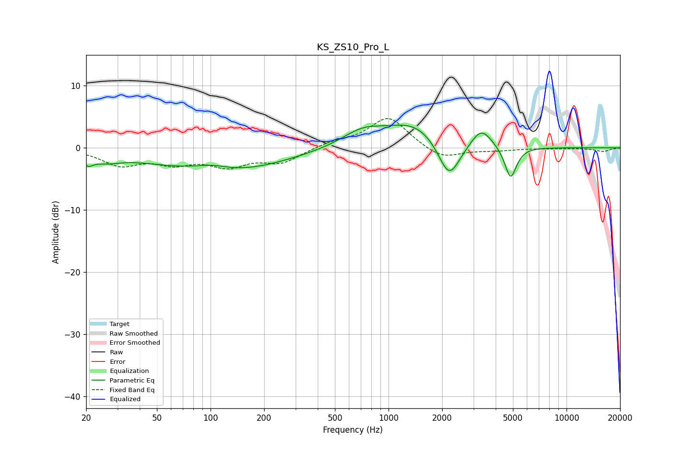

# KS_ZS10_Pro_L
See [usage instructions](https://github.com/jaakkopasanen/AutoEq#usage) for more options and info.

### Parametric EQs
Apply preamp of -3.7 dB when using parametric equalizer.

|   # | Type    |   Fc (Hz) |    Q |   Gain (dB) |
|-----|---------|-----------|------|-------------|
|   1 | Peaking |        20 | 4.91 |        -1.4 |
|   2 | Peaking |        26 | 1.8  |        -1.1 |
|   3 | Peaking |        86 | 0.35 |        -2.4 |
|   4 | Peaking |       101 | 1.48 |         0.9 |
|   5 | Peaking |       150 | 0.5  |        -1.6 |
|   6 | Peaking |       715 | 1.19 |         2.4 |
|   7 | Peaking |      1406 | 0.9  |         3.9 |
|   8 | Peaking |      2189 | 2.24 |        -6.6 |
|   9 | Peaking |      3322 | 2.44 |         3.2 |
|  10 | Peaking |      4852 | 4.25 |        -5.3 |

### Fixed Band EQs
When using fixed band (also called graphic) equalizer, apply preamp of **-4.8 dB** (if available) and set gains manually with these parameters.

|   # | Type    |   Fc (Hz) |    Q |   Gain (dB) |
|-----|---------|-----------|------|-------------|
|   1 | Peaking |        31 | 1.41 |        -2.6 |
|   2 | Peaking |        62 | 1.41 |        -2.1 |
|   3 | Peaking |       125 | 1.41 |        -2.6 |
|   4 | Peaking |       250 | 1.41 |        -2.2 |
|   5 | Peaking |       500 | 1.41 |         0.9 |
|   6 | Peaking |      1000 | 1.41 |         5   |
|   7 | Peaking |      2000 | 1.41 |        -2   |
|   8 | Peaking |      4000 | 1.41 |        -0.4 |
|   9 | Peaking |      8000 | 1.41 |        -0.1 |
|  10 | Peaking |     16000 | 1.41 |        -0.6 |

### Graphs

