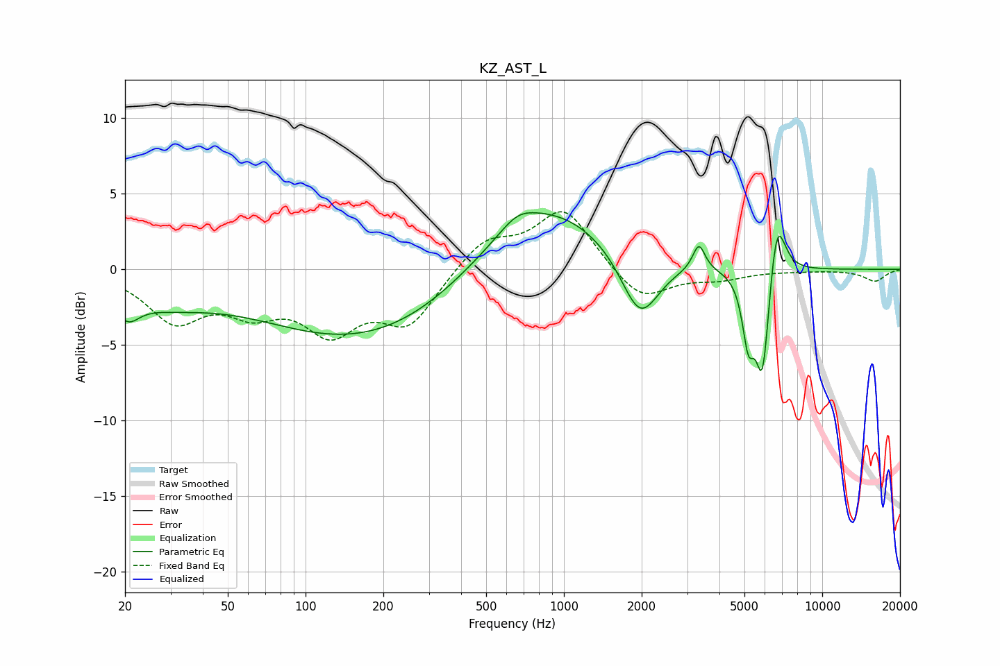

# KZ_AST_L
See [usage instructions](https://github.com/jaakkopasanen/AutoEq#usage) for more options and info.

### Parametric EQs
Apply preamp of -3.8 dB when using parametric equalizer.

|   # | Type    |   Fc (Hz) |    Q |   Gain (dB) |
|-----|---------|-----------|------|-------------|
|   1 | Peaking |        20 | 3.06 |        -1.6 |
|   2 | Peaking |        28 | 0.78 |        -1.6 |
|   3 | Peaking |       177 | 0.34 |        -4.8 |
|   4 | Peaking |       659 | 2.19 |         0.8 |
|   5 | Peaking |       797 | 0.54 |         5.1 |
|   6 | Peaking |      1971 | 1.87 |        -4.5 |
|   7 | Peaking |      3330 | 6    |         1.8 |
|   8 | Peaking |      5173 | 6    |        -4   |
|   9 | Peaking |      5879 | 4.98 |        -7.5 |
|  10 | Peaking |      6661 | 4.2  |         4.6 |

### Fixed Band EQs
When using fixed band (also called graphic) equalizer, apply preamp of **-3.9 dB** (if available) and set gains manually with these parameters.

|   # | Type    |   Fc (Hz) |    Q |   Gain (dB) |
|-----|---------|-----------|------|-------------|
|   1 | Peaking |        31 | 1.41 |        -3.2 |
|   2 | Peaking |        62 | 1.41 |        -2.2 |
|   3 | Peaking |       125 | 1.41 |        -3.6 |
|   4 | Peaking |       250 | 1.41 |        -3.4 |
|   5 | Peaking |       500 | 1.41 |         2   |
|   6 | Peaking |      1000 | 1.41 |         4   |
|   7 | Peaking |      2000 | 1.41 |        -2.2 |
|   8 | Peaking |      4000 | 1.41 |        -0.6 |
|   9 | Peaking |      8000 | 1.41 |        -0.1 |
|  10 | Peaking |     16000 | 1.41 |        -0.8 |

### Graphs

