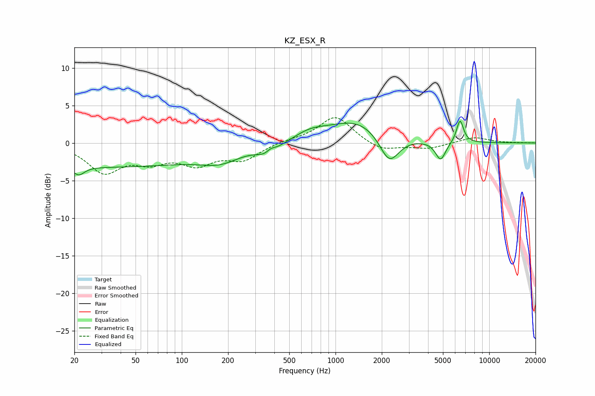

# KZ_ESX_R
See [usage instructions](https://github.com/jaakkopasanen/AutoEq#usage) for more options and info.

### Parametric EQs
Apply preamp of -3.0 dB when using parametric equalizer.

|   # | Type    |   Fc (Hz) |    Q |   Gain (dB) |
|-----|---------|-----------|------|-------------|
|   1 | Peaking |        21 | 3.99 |        -1.1 |
|   2 | Peaking |        30 | 0.18 |        -3.2 |
|   3 | Peaking |       178 | 1.13 |        -1.4 |
|   4 | Peaking |       370 | 2.5  |        -2.2 |
|   5 | Peaking |       378 | 3.8  |         1.6 |
|   6 | Peaking |       682 | 1.39 |         1   |
|   7 | Peaking |      1392 | 0.73 |         3.1 |
|   8 | Peaking |      2236 | 2.17 |        -4   |
|   9 | Peaking |      4827 | 4.23 |        -2.5 |
|  10 | Peaking |      6455 | 6    |         3.1 |

### Fixed Band EQs
When using fixed band (also called graphic) equalizer, apply preamp of **-3.5 dB** (if available) and set gains manually with these parameters.

|   # | Type    |   Fc (Hz) |    Q |   Gain (dB) |
|-----|---------|-----------|------|-------------|
|   1 | Peaking |        31 | 1.41 |        -3.7 |
|   2 | Peaking |        62 | 1.41 |        -2   |
|   3 | Peaking |       125 | 1.41 |        -2.5 |
|   4 | Peaking |       250 | 1.41 |        -2.1 |
|   5 | Peaking |       500 | 1.41 |         0.3 |
|   6 | Peaking |      1000 | 1.41 |         3.6 |
|   7 | Peaking |      2000 | 1.41 |        -1.2 |
|   8 | Peaking |      4000 | 1.41 |        -0.7 |
|   9 | Peaking |      8000 | 1.41 |         0.8 |
|  10 | Peaking |     16000 | 1.41 |         0   |

### Graphs

