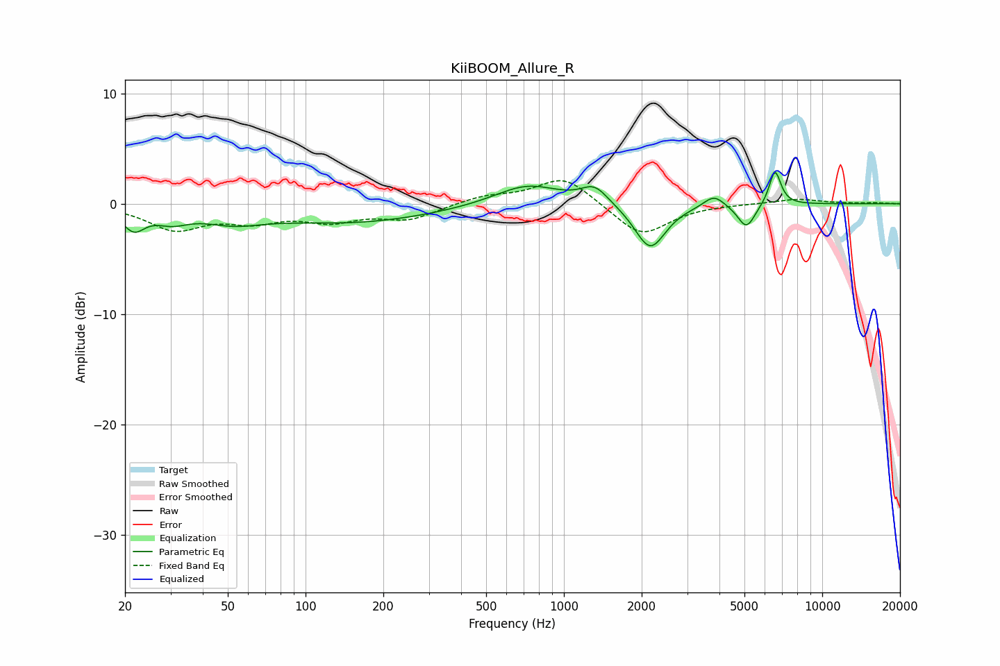

# KiiBOOM_Allure_R
See [usage instructions](https://github.com/jaakkopasanen/AutoEq#usage) for more options and info.

### Parametric EQs
Apply preamp of -2.9 dB when using parametric equalizer.

|   # | Type    |   Fc (Hz) |    Q |   Gain (dB) |
|-----|---------|-----------|------|-------------|
|   1 | Peaking |        22 | 3.29 |        -1.9 |
|   2 | Peaking |        30 | 2.19 |        -1.1 |
|   3 | Peaking |        52 | 1.2  |        -1.1 |
|   4 | Peaking |       151 | 0.44 |        -1.7 |
|   5 | Peaking |       720 | 1.11 |         1.9 |
|   6 | Peaking |      1316 | 2.73 |         1.6 |
|   7 | Peaking |      2158 | 2.37 |        -4.2 |
|   8 | Peaking |      3809 | 3.59 |         1.1 |
|   9 | Peaking |      5089 | 4.09 |        -2.2 |
|  10 | Peaking |      6562 | 6    |         3.2 |

### Fixed Band EQs
When using fixed band (also called graphic) equalizer, apply preamp of **-2.2 dB** (if available) and set gains manually with these parameters.

|   # | Type    |   Fc (Hz) |    Q |   Gain (dB) |
|-----|---------|-----------|------|-------------|
|   1 | Peaking |        31 | 1.41 |        -2.2 |
|   2 | Peaking |        62 | 1.41 |        -1.3 |
|   3 | Peaking |       125 | 1.41 |        -1.4 |
|   4 | Peaking |       250 | 1.41 |        -1.3 |
|   5 | Peaking |       500 | 1.41 |         0.7 |
|   6 | Peaking |      1000 | 1.41 |         2.5 |
|   7 | Peaking |      2000 | 1.41 |        -3   |
|   8 | Peaking |      4000 | 1.41 |        -0   |
|   9 | Peaking |      8000 | 1.41 |         0.4 |
|  10 | Peaking |     16000 | 1.41 |         0.1 |

### Graphs

