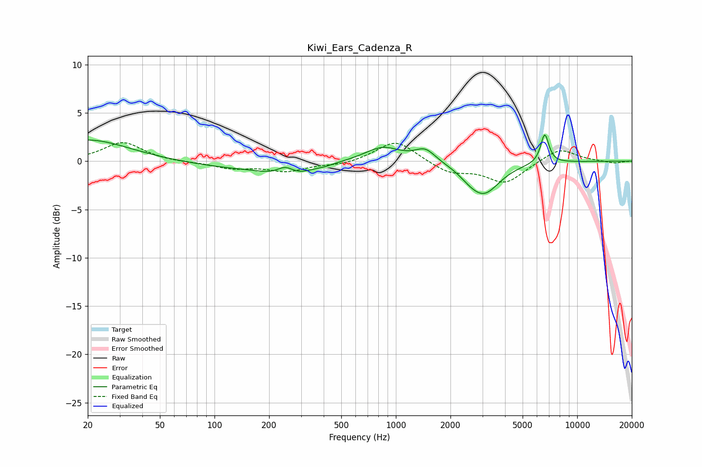

# Kiwi_Ears_Cadenza_R
See [usage instructions](https://github.com/jaakkopasanen/AutoEq#usage) for more options and info.

### Parametric EQs
Apply preamp of -2.8 dB when using parametric equalizer.

|   # | Type    |   Fc (Hz) |    Q |   Gain (dB) |
|-----|---------|-----------|------|-------------|
|   1 | Peaking |        20 | 0.63 |         2.2 |
|   2 | Peaking |       132 | 0.51 |        -0.7 |
|   3 | Peaking |       246 | 2.75 |         1.4 |
|   4 | Peaking |       255 | 1.37 |        -1.7 |
|   5 | Peaking |       408 | 3.15 |        -0.1 |
|   6 | Peaking |       845 | 1.41 |         1.5 |
|   7 | Peaking |      1453 | 2.5  |         1.3 |
|   8 | Peaking |      2530 | 2.64 |        -0.4 |
|   9 | Peaking |      3051 | 1.61 |        -3.3 |
|  10 | Peaking |      6622 | 6    |         3   |

### Fixed Band EQs
When using fixed band (also called graphic) equalizer, apply preamp of **-2.0 dB** (if available) and set gains manually with these parameters.

|   # | Type    |   Fc (Hz) |    Q |   Gain (dB) |
|-----|---------|-----------|------|-------------|
|   1 | Peaking |        31 | 1.41 |         2   |
|   2 | Peaking |        62 | 1.41 |        -0.1 |
|   3 | Peaking |       125 | 1.41 |        -0.7 |
|   4 | Peaking |       250 | 1.41 |        -1   |
|   5 | Peaking |       500 | 1.41 |        -0.4 |
|   6 | Peaking |      1000 | 1.41 |         2.2 |
|   7 | Peaking |      2000 | 1.41 |        -1.2 |
|   8 | Peaking |      4000 | 1.41 |        -2.2 |
|   9 | Peaking |      8000 | 1.41 |         1.4 |
|  10 | Peaking |     16000 | 1.41 |        -0.2 |

### Graphs

