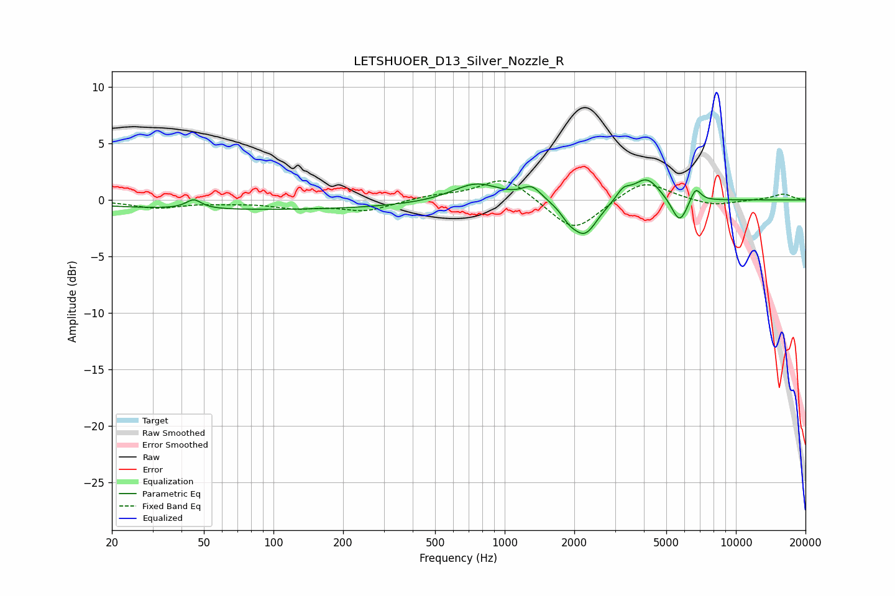

# LETSHUOER_D13_Silver_Nozzle_R
See [usage instructions](https://github.com/jaakkopasanen/AutoEq#usage) for more options and info.

### Parametric EQs
Apply preamp of -1.9 dB when using parametric equalizer.

|   # | Type    |   Fc (Hz) |    Q |   Gain (dB) |
|-----|---------|-----------|------|-------------|
|   1 | Peaking |        45 | 4.34 |         0.8 |
|   2 | Peaking |        85 | 0.18 |        -0.9 |
|   3 | Peaking |       752 | 1.37 |         1.6 |
|   4 | Peaking |      1309 | 3.37 |         1.2 |
|   5 | Peaking |      1892 | 4.32 |        -0.7 |
|   6 | Peaking |      2216 | 2.48 |        -3.1 |
|   7 | Peaking |      3257 | 4.75 |         0.9 |
|   8 | Peaking |      4108 | 2.4  |         2.1 |
|   9 | Peaking |      5706 | 4.06 |        -2.3 |
|  10 | Peaking |      6690 | 6    |         1.3 |

### Fixed Band EQs
When using fixed band (also called graphic) equalizer, apply preamp of **-1.8 dB** (if available) and set gains manually with these parameters.

|   # | Type    |   Fc (Hz) |    Q |   Gain (dB) |
|-----|---------|-----------|------|-------------|
|   1 | Peaking |        31 | 1.41 |        -0.7 |
|   2 | Peaking |        62 | 1.41 |        -0.2 |
|   3 | Peaking |       125 | 1.41 |        -0.6 |
|   4 | Peaking |       250 | 1.41 |        -0.9 |
|   5 | Peaking |       500 | 1.41 |         0.4 |
|   6 | Peaking |      1000 | 1.41 |         2.1 |
|   7 | Peaking |      2000 | 1.41 |        -2.9 |
|   8 | Peaking |      4000 | 1.41 |         1.8 |
|   9 | Peaking |      8000 | 1.41 |        -0.6 |
|  10 | Peaking |     16000 | 1.41 |         0.5 |

### Graphs

