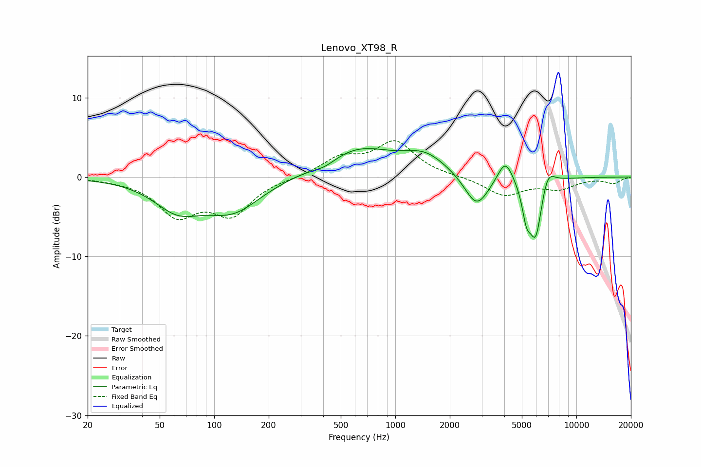

# Lenovo_XT98_R
See [usage instructions](https://github.com/jaakkopasanen/AutoEq#usage) for more options and info.

### Parametric EQs
Apply preamp of -3.7 dB when using parametric equalizer.

|   # | Type    |   Fc (Hz) |    Q |   Gain (dB) |
|-----|---------|-----------|------|-------------|
|   1 | Peaking |        63 | 1.08 |        -3.5 |
|   2 | Peaking |       127 | 0.9  |        -4   |
|   3 | Peaking |       408 | 2.12 |        -0.8 |
|   4 | Peaking |       620 | 0.71 |         3.6 |
|   5 | Peaking |      1465 | 1.19 |         2.3 |
|   6 | Peaking |      2815 | 2.13 |        -4.2 |
|   7 | Peaking |      4055 | 3.35 |         3   |
|   8 | Peaking |      5298 | 5.91 |        -3.4 |
|   9 | Peaking |      5963 | 3.73 |        -7.7 |
|  10 | Peaking |      6905 | 3.54 |         2.6 |

### Fixed Band EQs
When using fixed band (also called graphic) equalizer, apply preamp of **-4.7 dB** (if available) and set gains manually with these parameters.

|   # | Type    |   Fc (Hz) |    Q |   Gain (dB) |
|-----|---------|-----------|------|-------------|
|   1 | Peaking |        31 | 1.41 |        -0.2 |
|   2 | Peaking |        62 | 1.41 |        -4.5 |
|   3 | Peaking |       125 | 1.41 |        -4.4 |
|   4 | Peaking |       250 | 1.41 |        -0.1 |
|   5 | Peaking |       500 | 1.41 |         2.2 |
|   6 | Peaking |      1000 | 1.41 |         4.3 |
|   7 | Peaking |      2000 | 1.41 |         0   |
|   8 | Peaking |      4000 | 1.41 |        -2.3 |
|   9 | Peaking |      8000 | 1.41 |        -1.3 |
|  10 | Peaking |     16000 | 1.41 |        -0.8 |

### Graphs

