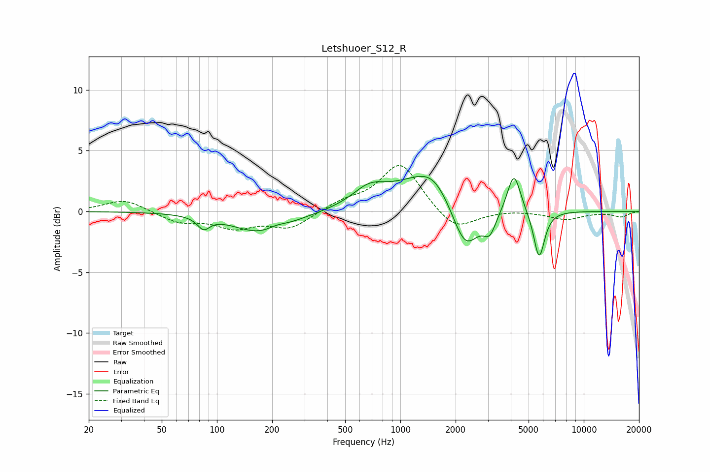

# Letshuoer_S12_R
See [usage instructions](https://github.com/jaakkopasanen/AutoEq#usage) for more options and info.

### Parametric EQs
Apply preamp of -3.0 dB when using parametric equalizer.

|   # | Type    |   Fc (Hz) |    Q |   Gain (dB) |
|-----|---------|-----------|------|-------------|
|   1 | Peaking |        85 | 4.32 |        -1   |
|   2 | Peaking |       179 | 0.91 |        -1.9 |
|   3 | Peaking |       211 | 2.53 |         0.4 |
|   4 | Peaking |       678 | 1.52 |         1.5 |
|   5 | Peaking |      1394 | 0.82 |         2.9 |
|   6 | Peaking |      1521 | 1.88 |         0.8 |
|   7 | Peaking |      2257 | 1.87 |        -4.2 |
|   8 | Peaking |      3071 | 4.06 |        -1.6 |
|   9 | Peaking |      4163 | 3.93 |         3.3 |
|  10 | Peaking |      5708 | 4.64 |        -4   |

### Fixed Band EQs
When using fixed band (also called graphic) equalizer, apply preamp of **-3.9 dB** (if available) and set gains manually with these parameters.

|   # | Type    |   Fc (Hz) |    Q |   Gain (dB) |
|-----|---------|-----------|------|-------------|
|   1 | Peaking |        31 | 1.41 |         1   |
|   2 | Peaking |        62 | 1.41 |        -0.9 |
|   3 | Peaking |       125 | 1.41 |        -1.2 |
|   4 | Peaking |       250 | 1.41 |        -1.3 |
|   5 | Peaking |       500 | 1.41 |         0.7 |
|   6 | Peaking |      1000 | 1.41 |         4   |
|   7 | Peaking |      2000 | 1.41 |        -1.7 |
|   8 | Peaking |      4000 | 1.41 |         0.1 |
|   9 | Peaking |      8000 | 1.41 |        -0.6 |
|  10 | Peaking |     16000 | 1.41 |        -0.4 |

### Graphs

