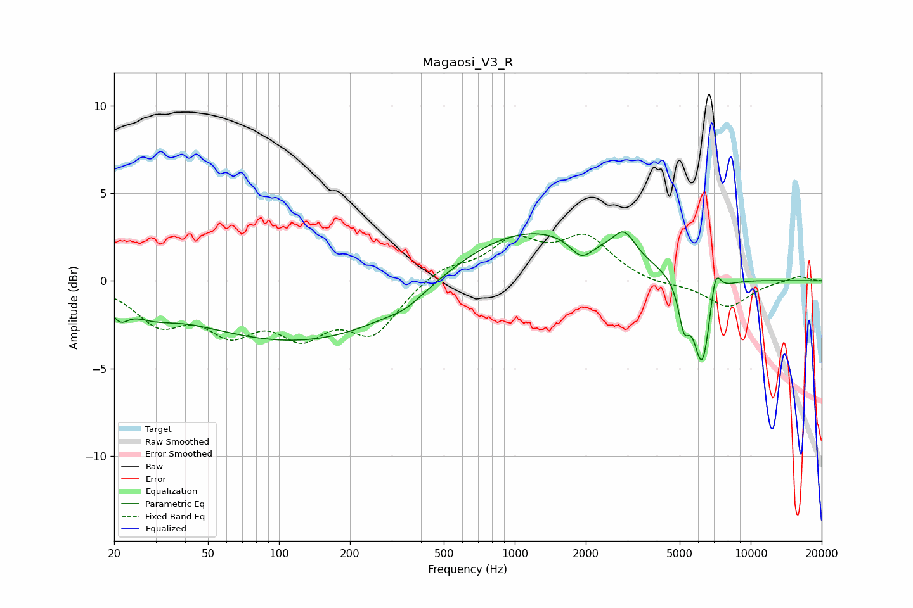

# Magaosi_V3_R
See [usage instructions](https://github.com/jaakkopasanen/AutoEq#usage) for more options and info.

### Parametric EQs
Apply preamp of -2.9 dB when using parametric equalizer.

|   # | Type    |   Fc (Hz) |    Q |   Gain (dB) |
|-----|---------|-----------|------|-------------|
|   1 | Peaking |        21 | 3.9  |        -1   |
|   2 | Peaking |        29 | 1.45 |        -0.8 |
|   3 | Peaking |       142 | 0.27 |        -3.7 |
|   4 | Peaking |       346 | 2.03 |        -0.4 |
|   5 | Peaking |      1036 | 0.39 |         3.5 |
|   6 | Peaking |      1914 | 2.92 |        -1.1 |
|   7 | Peaking |      2905 | 3.03 |         1.4 |
|   8 | Peaking |      5213 | 6    |        -2.3 |
|   9 | Peaking |      6233 | 3.76 |        -5.2 |
|  10 | Peaking |      7072 | 5.91 |         2   |

### Fixed Band EQs
When using fixed band (also called graphic) equalizer, apply preamp of **-2.8 dB** (if available) and set gains manually with these parameters.

|   # | Type    |   Fc (Hz) |    Q |   Gain (dB) |
|-----|---------|-----------|------|-------------|
|   1 | Peaking |        31 | 1.41 |        -2.2 |
|   2 | Peaking |        62 | 1.41 |        -2.4 |
|   3 | Peaking |       125 | 1.41 |        -2.6 |
|   4 | Peaking |       250 | 1.41 |        -2.8 |
|   5 | Peaking |       500 | 1.41 |         0.8 |
|   6 | Peaking |      1000 | 1.41 |         2.1 |
|   7 | Peaking |      2000 | 1.41 |         2.4 |
|   8 | Peaking |      4000 | 1.41 |        -0.3 |
|   9 | Peaking |      8000 | 1.41 |        -1.5 |
|  10 | Peaking |     16000 | 1.41 |         0.3 |

### Graphs

