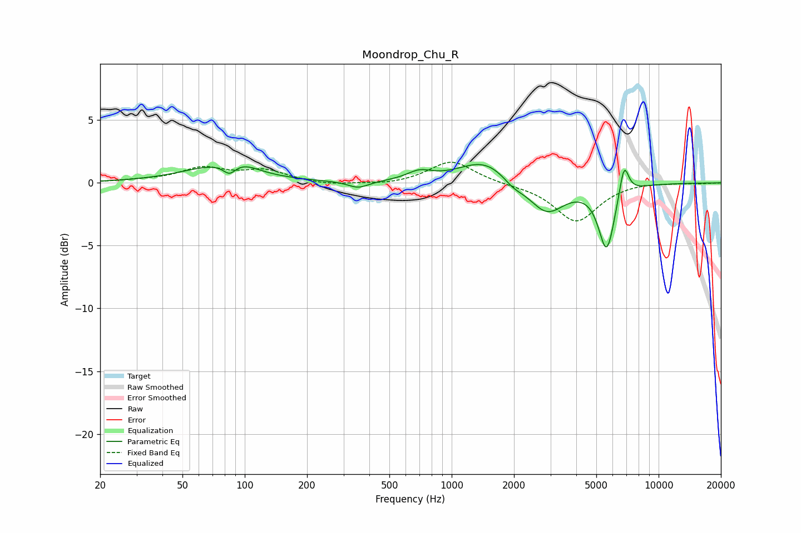

# Moondrop_Chu_R
See [usage instructions](https://github.com/jaakkopasanen/AutoEq#usage) for more options and info.

### Parametric EQs
Apply preamp of -1.6 dB when using parametric equalizer.

|   # | Type    |   Fc (Hz) |    Q |   Gain (dB) |
|-----|---------|-----------|------|-------------|
|   1 | Peaking |        74 | 0.82 |         1.3 |
|   2 | Peaking |        84 | 4.65 |        -0.8 |
|   3 | Peaking |        98 | 1.94 |         0.5 |
|   4 | Peaking |       354 | 2.75 |        -0.6 |
|   5 | Peaking |       698 | 2.36 |         0.7 |
|   6 | Peaking |      1448 | 1.12 |         1.9 |
|   7 | Peaking |      1982 | 2.84 |        -0.6 |
|   8 | Peaking |      2877 | 1.62 |        -2.5 |
|   9 | Peaking |      5610 | 3.52 |        -5.2 |
|  10 | Peaking |      6806 | 5.97 |         2.6 |

### Fixed Band EQs
When using fixed band (also called graphic) equalizer, apply preamp of **-1.7 dB** (if available) and set gains manually with these parameters.

|   # | Type    |   Fc (Hz) |    Q |   Gain (dB) |
|-----|---------|-----------|------|-------------|
|   1 | Peaking |        31 | 1.41 |         0.1 |
|   2 | Peaking |        62 | 1.41 |         1.1 |
|   3 | Peaking |       125 | 1.41 |         0.9 |
|   4 | Peaking |       250 | 1.41 |        -0.2 |
|   5 | Peaking |       500 | 1.41 |        -0.2 |
|   6 | Peaking |      1000 | 1.41 |         1.8 |
|   7 | Peaking |      2000 | 1.41 |        -0.1 |
|   8 | Peaking |      4000 | 1.41 |        -3.1 |
|   9 | Peaking |      8000 | 1.41 |         0.1 |
|  10 | Peaking |     16000 | 1.41 |        -0   |

### Graphs

