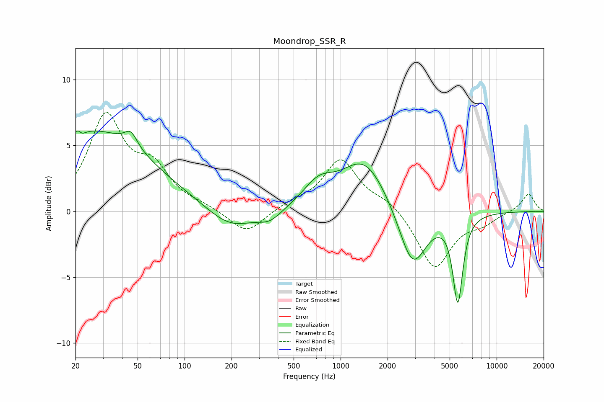

# Moondrop_SSR_R
See [usage instructions](https://github.com/jaakkopasanen/AutoEq#usage) for more options and info.

### Parametric EQs
Apply preamp of -6.2 dB when using parametric equalizer.

|   # | Type    |   Fc (Hz) |    Q |   Gain (dB) |
|-----|---------|-----------|------|-------------|
|   1 | Peaking |        21 | 5.9  |         3   |
|   2 | Peaking |        21 | 5.96 |        -3   |
|   3 | Peaking |        26 | 0.38 |         6.1 |
|   4 | Peaking |        45 | 3.44 |         1.1 |
|   5 | Peaking |       197 | 0.95 |        -1.6 |
|   6 | Peaking |       353 | 1.87 |        -0.8 |
|   7 | Peaking |       722 | 1.43 |         1.7 |
|   8 | Peaking |      1423 | 0.97 |         3.9 |
|   9 | Peaking |      2892 | 1.62 |        -4.7 |
|  10 | Peaking |      5640 | 4.37 |        -6.5 |

### Fixed Band EQs
When using fixed band (also called graphic) equalizer, apply preamp of **-7.6 dB** (if available) and set gains manually with these parameters.

|   # | Type    |   Fc (Hz) |    Q |   Gain (dB) |
|-----|---------|-----------|------|-------------|
|   1 | Peaking |        31 | 1.41 |         7   |
|   2 | Peaking |        62 | 1.41 |         2.8 |
|   3 | Peaking |       125 | 1.41 |         0.3 |
|   4 | Peaking |       250 | 1.41 |        -1.8 |
|   5 | Peaking |       500 | 1.41 |         0.5 |
|   6 | Peaking |      1000 | 1.41 |         3.9 |
|   7 | Peaking |      2000 | 1.41 |         0.8 |
|   8 | Peaking |      4000 | 1.41 |        -4.4 |
|   9 | Peaking |      8000 | 1.41 |        -0.8 |
|  10 | Peaking |     16000 | 1.41 |         1.4 |

### Graphs

