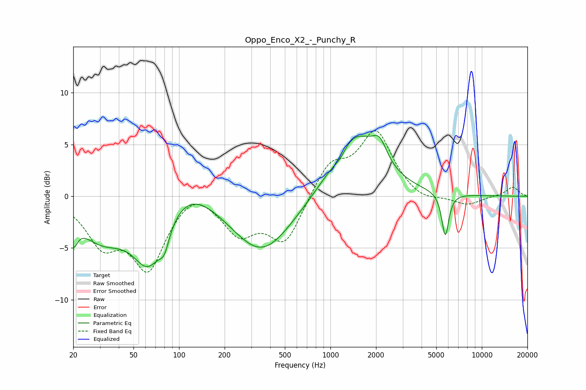

# Oppo_Enco_X2_-_Punchy_R
See [usage instructions](https://github.com/jaakkopasanen/AutoEq#usage) for more options and info.

### Parametric EQs
Apply preamp of -6.0 dB when using parametric equalizer.

|   # | Type    |   Fc (Hz) |    Q |   Gain (dB) |
|-----|---------|-----------|------|-------------|
|   1 | Peaking |        20 | 5.35 |        -2.3 |
|   2 | Peaking |        31 | 0.89 |        -3.7 |
|   3 | Peaking |        63 | 1.32 |        -6   |
|   4 | Peaking |        80 | 4.28 |        -1.8 |
|   5 | Peaking |       113 | 0.81 |         2.4 |
|   6 | Peaking |       353 | 0.7  |        -5.6 |
|   7 | Peaking |      1151 | 3.48 |        -0.7 |
|   8 | Peaking |      1442 | 0.9  |         6.2 |
|   9 | Peaking |      2112 | 2.97 |         2   |
|  10 | Peaking |      5736 | 6    |        -4.2 |

### Fixed Band EQs
When using fixed band (also called graphic) equalizer, apply preamp of **-6.4 dB** (if available) and set gains manually with these parameters.

|   # | Type    |   Fc (Hz) |    Q |   Gain (dB) |
|-----|---------|-----------|------|-------------|
|   1 | Peaking |        31 | 1.41 |        -4.1 |
|   2 | Peaking |        62 | 1.41 |        -6.6 |
|   3 | Peaking |       125 | 1.41 |         1.3 |
|   4 | Peaking |       250 | 1.41 |        -3.4 |
|   5 | Peaking |       500 | 1.41 |        -4.4 |
|   6 | Peaking |      1000 | 1.41 |         3.1 |
|   7 | Peaking |      2000 | 1.41 |         6.1 |
|   8 | Peaking |      4000 | 1.41 |        -0.7 |
|   9 | Peaking |      8000 | 1.41 |        -0.9 |
|  10 | Peaking |     16000 | 1.41 |         0.9 |

### Graphs

