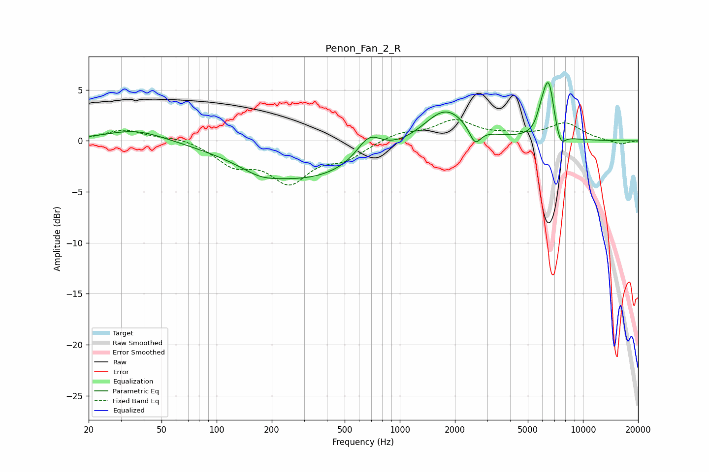

# Penon_Fan_2_R
See [usage instructions](https://github.com/jaakkopasanen/AutoEq#usage) for more options and info.

### Parametric EQs
Apply preamp of -5.8 dB when using parametric equalizer.

|   # | Type    |   Fc (Hz) |    Q |   Gain (dB) |
|-----|---------|-----------|------|-------------|
|   1 | Peaking |        36 | 0.87 |         1.2 |
|   2 | Peaking |       173 | 1.44 |        -0.7 |
|   3 | Peaking |       311 | 0.42 |        -3.7 |
|   4 | Peaking |       679 | 2.07 |         2.3 |
|   5 | Peaking |      1775 | 1.18 |         3.4 |
|   6 | Peaking |      2574 | 4.52 |        -1.7 |
|   7 | Peaking |      5913 | 5.42 |         1.3 |
|   8 | Peaking |      6402 | 4.76 |         4   |
|   9 | Peaking |      6679 | 6    |         1.6 |
|  10 | Peaking |      7560 | 5.32 |        -1.3 |

### Fixed Band EQs
When using fixed band (also called graphic) equalizer, apply preamp of **-2.2 dB** (if available) and set gains manually with these parameters.

|   # | Type    |   Fc (Hz) |    Q |   Gain (dB) |
|-----|---------|-----------|------|-------------|
|   1 | Peaking |        31 | 1.41 |         1.1 |
|   2 | Peaking |        62 | 1.41 |         0.4 |
|   3 | Peaking |       125 | 1.41 |        -2.1 |
|   4 | Peaking |       250 | 1.41 |        -3.7 |
|   5 | Peaking |       500 | 1.41 |        -1.5 |
|   6 | Peaking |      1000 | 1.41 |         0.8 |
|   7 | Peaking |      2000 | 1.41 |         1.9 |
|   8 | Peaking |      4000 | 1.41 |         0.4 |
|   9 | Peaking |      8000 | 1.41 |         1.7 |
|  10 | Peaking |     16000 | 1.41 |        -0.4 |

### Graphs

