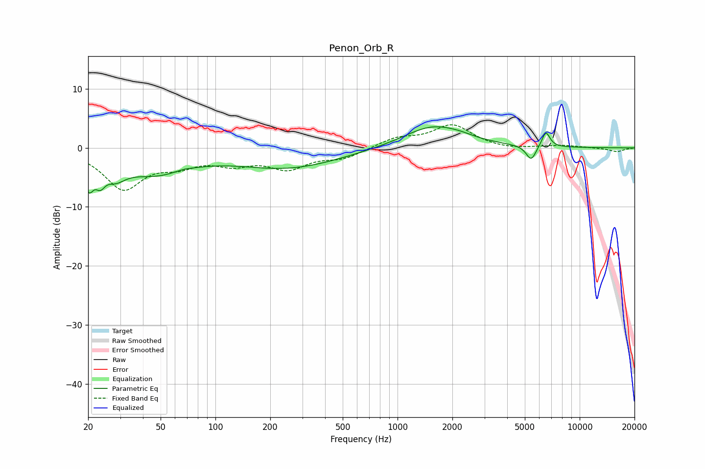

# Penon_Orb_R
See [usage instructions](https://github.com/jaakkopasanen/AutoEq#usage) for more options and info.

### Parametric EQs
Apply preamp of -3.7 dB when using parametric equalizer.

|   # | Type    |   Fc (Hz) |    Q |   Gain (dB) |
|-----|---------|-----------|------|-------------|
|   1 | Peaking |        20 | 5.36 |        -4.7 |
|   2 | Peaking |        23 | 5.43 |        -2.5 |
|   3 | Peaking |        28 | 2.41 |        -2.7 |
|   4 | Peaking |        46 | 0.77 |        -4   |
|   5 | Peaking |        67 | 2.97 |         0.3 |
|   6 | Peaking |       250 | 0.49 |        -3.3 |
|   7 | Peaking |      1576 | 0.86 |         3.8 |
|   8 | Peaking |      2222 | 2.31 |         0.3 |
|   9 | Peaking |      5415 | 5.11 |        -2.5 |
|  10 | Peaking |      6521 | 6    |         2.7 |

### Fixed Band EQs
When using fixed band (also called graphic) equalizer, apply preamp of **-4.0 dB** (if available) and set gains manually with these parameters.

|   # | Type    |   Fc (Hz) |    Q |   Gain (dB) |
|-----|---------|-----------|------|-------------|
|   1 | Peaking |        31 | 1.41 |        -6.7 |
|   2 | Peaking |        62 | 1.41 |        -2.2 |
|   3 | Peaking |       125 | 1.41 |        -2.2 |
|   4 | Peaking |       250 | 1.41 |        -3.1 |
|   5 | Peaking |       500 | 1.41 |        -1.6 |
|   6 | Peaking |      1000 | 1.41 |         1.6 |
|   7 | Peaking |      2000 | 1.41 |         3.8 |
|   8 | Peaking |      4000 | 1.41 |        -0.4 |
|   9 | Peaking |      8000 | 1.41 |         0.4 |
|  10 | Peaking |     16000 | 1.41 |        -0.7 |

### Graphs

