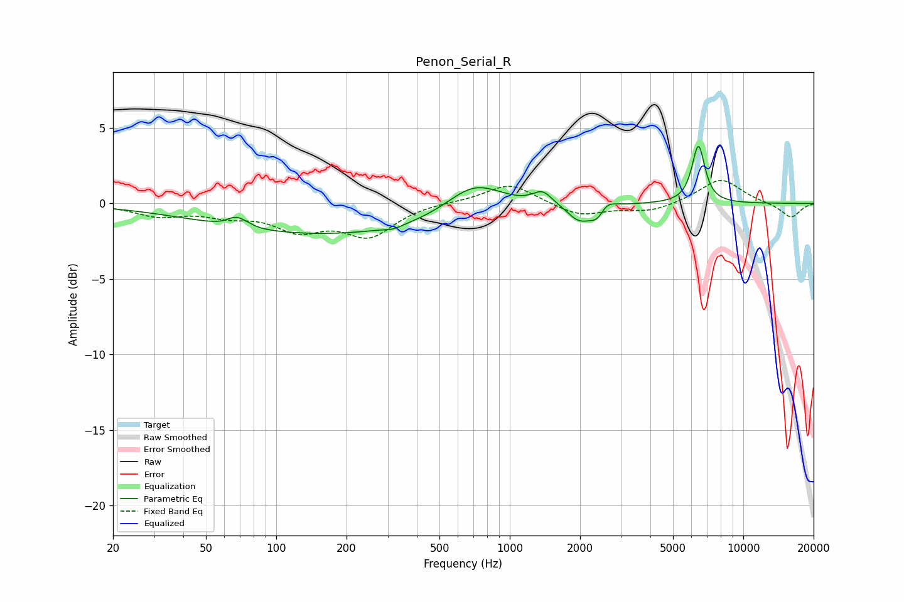

# Penon_Serial_R
See [usage instructions](https://github.com/jaakkopasanen/AutoEq#usage) for more options and info.

### Parametric EQs
Apply preamp of -3.9 dB when using parametric equalizer.

|   # | Type    |   Fc (Hz) |    Q |   Gain (dB) |
|-----|---------|-----------|------|-------------|
|   1 | Peaking |        67 | 4.1  |         0.6 |
|   2 | Peaking |        74 | 4.77 |         0.2 |
|   3 | Peaking |       176 | 0.25 |        -2.1 |
|   4 | Peaking |       317 | 3.65 |        -0.2 |
|   5 | Peaking |       705 | 1.15 |         2.1 |
|   6 | Peaking |      1381 | 3.43 |         0.9 |
|   7 | Peaking |      1977 | 2.81 |        -1.1 |
|   8 | Peaking |      2398 | 3.89 |        -1.2 |
|   9 | Peaking |      2560 | 3.89 |         0.9 |
|  10 | Peaking |      6422 | 5.03 |         3.8 |

### Fixed Band EQs
When using fixed band (also called graphic) equalizer, apply preamp of **-1.6 dB** (if available) and set gains manually with these parameters.

|   # | Type    |   Fc (Hz) |    Q |   Gain (dB) |
|-----|---------|-----------|------|-------------|
|   1 | Peaking |        31 | 1.41 |        -0.7 |
|   2 | Peaking |        62 | 1.41 |        -0.6 |
|   3 | Peaking |       125 | 1.41 |        -1.6 |
|   4 | Peaking |       250 | 1.41 |        -2   |
|   5 | Peaking |       500 | 1.41 |         0.1 |
|   6 | Peaking |      1000 | 1.41 |         1.4 |
|   7 | Peaking |      2000 | 1.41 |        -0.8 |
|   8 | Peaking |      4000 | 1.41 |        -0.5 |
|   9 | Peaking |      8000 | 1.41 |         1.7 |
|  10 | Peaking |     16000 | 1.41 |        -1   |

### Graphs

