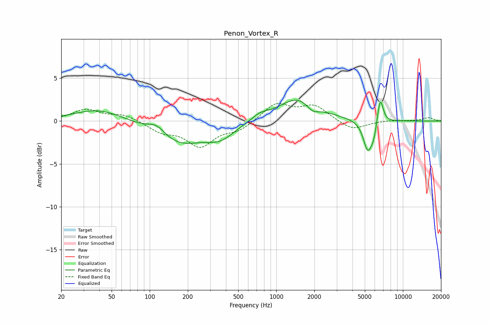

# Penon_Vortex_R
See [usage instructions](https://github.com/jaakkopasanen/AutoEq#usage) for more options and info.

### Parametric EQs
Apply preamp of -2.5 dB when using parametric equalizer.

|   # | Type    |   Fc (Hz) |    Q |   Gain (dB) |
|-----|---------|-----------|------|-------------|
|   1 | Peaking |        40 | 0.74 |         1.4 |
|   2 | Peaking |       113 | 1.89 |         1.2 |
|   3 | Peaking |       167 | 0.7  |        -2.7 |
|   4 | Peaking |       363 | 1.28 |        -1.5 |
|   5 | Peaking |       746 | 2.1  |         0.7 |
|   6 | Peaking |      1521 | 0.93 |         2.9 |
|   7 | Peaking |      1930 | 2.58 |        -1.1 |
|   8 | Peaking |      5282 | 3.94 |        -3.5 |
|   9 | Peaking |      5882 | 6    |        -1.3 |
|  10 | Peaking |      6626 | 6    |         3.1 |

### Fixed Band EQs
When using fixed band (also called graphic) equalizer, apply preamp of **-2.2 dB** (if available) and set gains manually with these parameters.

|   # | Type    |   Fc (Hz) |    Q |   Gain (dB) |
|-----|---------|-----------|------|-------------|
|   1 | Peaking |        31 | 1.41 |         1.3 |
|   2 | Peaking |        62 | 1.41 |         0.7 |
|   3 | Peaking |       125 | 1.41 |        -1.1 |
|   4 | Peaking |       250 | 1.41 |        -2.8 |
|   5 | Peaking |       500 | 1.41 |        -1   |
|   6 | Peaking |      1000 | 1.41 |         2   |
|   7 | Peaking |      2000 | 1.41 |         1.7 |
|   8 | Peaking |      4000 | 1.41 |        -1.1 |
|   9 | Peaking |      8000 | 1.41 |         0.1 |
|  10 | Peaking |     16000 | 1.41 |         0.4 |

### Graphs

