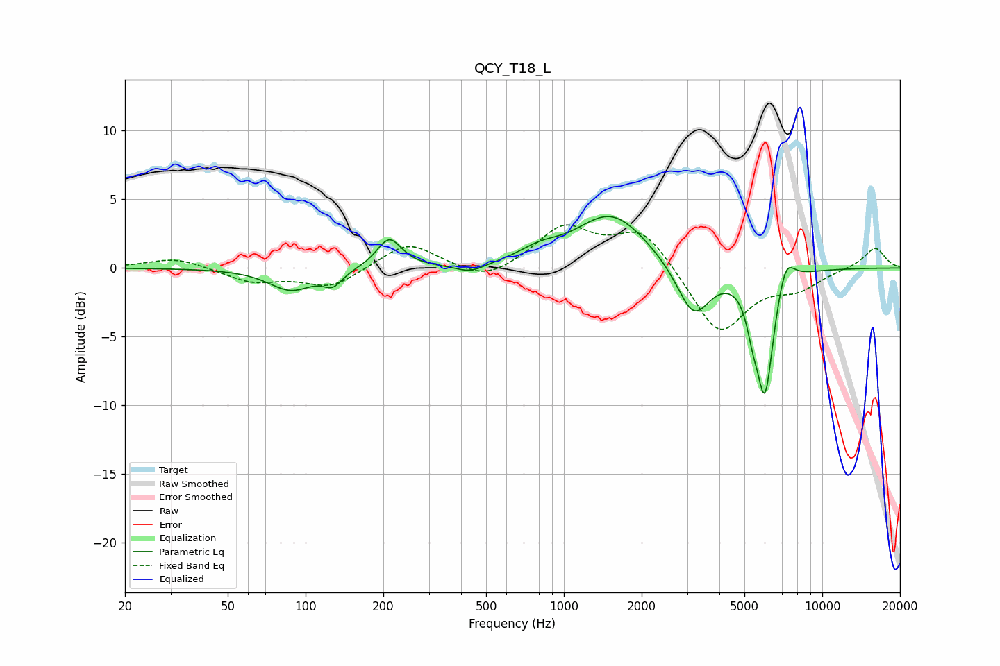

# QCY_T18_L
See [usage instructions](https://github.com/jaakkopasanen/AutoEq#usage) for more options and info.

### Parametric EQs
Apply preamp of -3.8 dB when using parametric equalizer.

|   # | Type    |   Fc (Hz) |    Q |   Gain (dB) |
|-----|---------|-----------|------|-------------|
|   1 | Peaking |        88 | 1.67 |        -1.6 |
|   2 | Peaking |       128 | 3.84 |        -1   |
|   3 | Peaking |       211 | 2.97 |         2.2 |
|   4 | Peaking |       435 | 2.41 |        -0.6 |
|   5 | Peaking |       802 | 1.93 |         0.7 |
|   6 | Peaking |      1528 | 1.02 |         4   |
|   7 | Peaking |      3176 | 2.18 |        -3.9 |
|   8 | Peaking |      5370 | 6    |        -1.7 |
|   9 | Peaking |      6000 | 4.07 |        -9   |
|  10 | Peaking |      7220 | 4.08 |         2.1 |

### Fixed Band EQs
When using fixed band (also called graphic) equalizer, apply preamp of **-3.2 dB** (if available) and set gains manually with these parameters.

|   # | Type    |   Fc (Hz) |    Q |   Gain (dB) |
|-----|---------|-----------|------|-------------|
|   1 | Peaking |        31 | 1.41 |         0.8 |
|   2 | Peaking |        62 | 1.41 |        -1   |
|   3 | Peaking |       125 | 1.41 |        -1.4 |
|   4 | Peaking |       250 | 1.41 |         1.9 |
|   5 | Peaking |       500 | 1.41 |        -1.1 |
|   6 | Peaking |      1000 | 1.41 |         2.9 |
|   7 | Peaking |      2000 | 1.41 |         2.8 |
|   8 | Peaking |      4000 | 1.41 |        -4.9 |
|   9 | Peaking |      8000 | 1.41 |        -1.3 |
|  10 | Peaking |     16000 | 1.41 |         1.5 |

### Graphs

