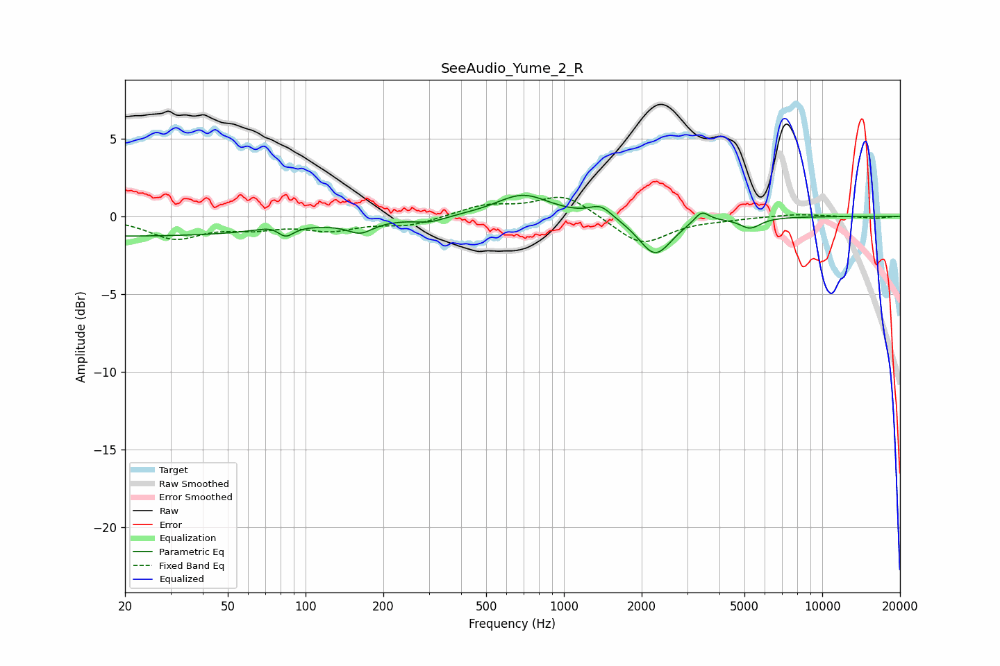

# SeeAudio_Yume_2_R
See [usage instructions](https://github.com/jaakkopasanen/AutoEq#usage) for more options and info.

### Parametric EQs
Apply preamp of -1.4 dB when using parametric equalizer.

|   # | Type    |   Fc (Hz) |    Q |   Gain (dB) |
|-----|---------|-----------|------|-------------|
|   1 | Peaking |        20 | 0.18 |        -1.3 |
|   2 | Peaking |        80 | 2.5  |         0.7 |
|   3 | Peaking |        83 | 4.08 |        -1.1 |
|   4 | Peaking |       163 | 2.95 |        -0.7 |
|   5 | Peaking |       303 | 2.45 |        -0.3 |
|   6 | Peaking |       693 | 1.37 |         1.4 |
|   7 | Peaking |      1387 | 3.27 |         0.7 |
|   8 | Peaking |      2258 | 2.21 |        -2.5 |
|   9 | Peaking |      3415 | 4.94 |         0.7 |
|  10 | Peaking |      5259 | 3.52 |        -0.7 |

### Fixed Band EQs
When using fixed band (also called graphic) equalizer, apply preamp of **-1.3 dB** (if available) and set gains manually with these parameters.

|   # | Type    |   Fc (Hz) |    Q |   Gain (dB) |
|-----|---------|-----------|------|-------------|
|   1 | Peaking |        31 | 1.41 |        -1.3 |
|   2 | Peaking |        62 | 1.41 |        -0.6 |
|   3 | Peaking |       125 | 1.41 |        -0.8 |
|   4 | Peaking |       250 | 1.41 |        -0.6 |
|   5 | Peaking |       500 | 1.41 |         0.7 |
|   6 | Peaking |      1000 | 1.41 |         1.4 |
|   7 | Peaking |      2000 | 1.41 |        -1.9 |
|   8 | Peaking |      4000 | 1.41 |        -0.1 |
|   9 | Peaking |      8000 | 1.41 |         0.2 |
|  10 | Peaking |     16000 | 1.41 |        -0.1 |

### Graphs

