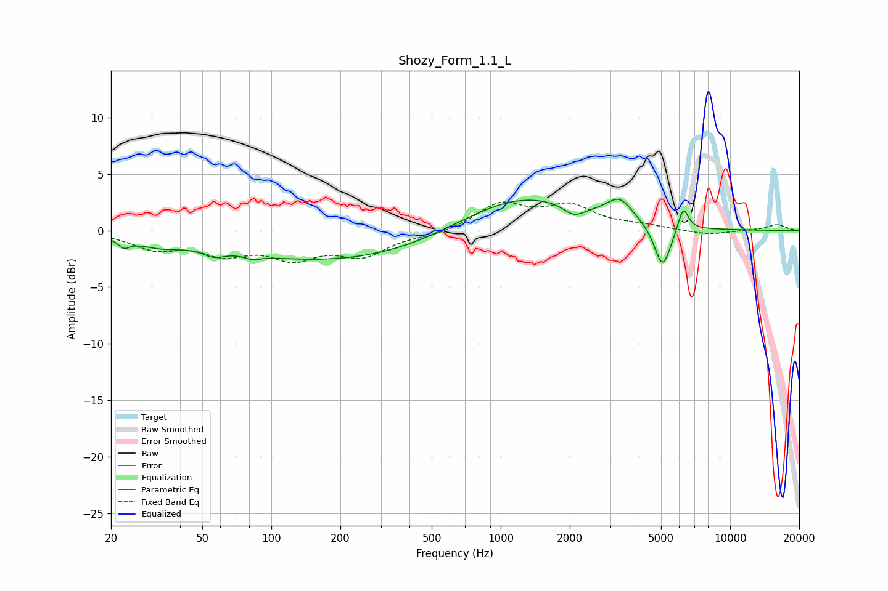

# Shozy_Form_1.1_L
See [usage instructions](https://github.com/jaakkopasanen/AutoEq#usage) for more options and info.

### Parametric EQs
Apply preamp of -2.9 dB when using parametric equalizer.

|   # | Type    |   Fc (Hz) |    Q |   Gain (dB) |
|-----|---------|-----------|------|-------------|
|   1 | Peaking |        23 | 5.57 |        -0.7 |
|   2 | Peaking |        32 | 1.34 |        -0.8 |
|   3 | Peaking |        56 | 3.16 |        -0.7 |
|   4 | Peaking |        83 | 4.17 |        -0.4 |
|   5 | Peaking |       201 | 0.28 |        -2.8 |
|   6 | Peaking |      1206 | 0.51 |         3.4 |
|   7 | Peaking |      2085 | 3.03 |        -1   |
|   8 | Peaking |      3303 | 2.51 |         1.9 |
|   9 | Peaking |      5077 | 3.85 |        -3.9 |
|  10 | Peaking |      6245 | 6    |         2.2 |

### Fixed Band EQs
When using fixed band (also called graphic) equalizer, apply preamp of **-2.6 dB** (if available) and set gains manually with these parameters.

|   # | Type    |   Fc (Hz) |    Q |   Gain (dB) |
|-----|---------|-----------|------|-------------|
|   1 | Peaking |        31 | 1.41 |        -1.4 |
|   2 | Peaking |        62 | 1.41 |        -1.8 |
|   3 | Peaking |       125 | 1.41 |        -2.1 |
|   4 | Peaking |       250 | 1.41 |        -2   |
|   5 | Peaking |       500 | 1.41 |        -0.4 |
|   6 | Peaking |      1000 | 1.41 |         2.3 |
|   7 | Peaking |      2000 | 1.41 |         2   |
|   8 | Peaking |      4000 | 1.41 |         0.4 |
|   9 | Peaking |      8000 | 1.41 |        -0.4 |
|  10 | Peaking |     16000 | 1.41 |         0.5 |

### Graphs

